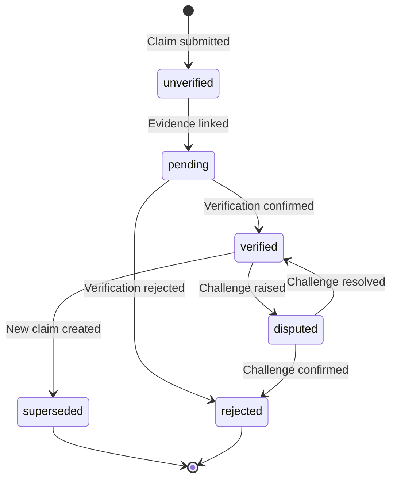
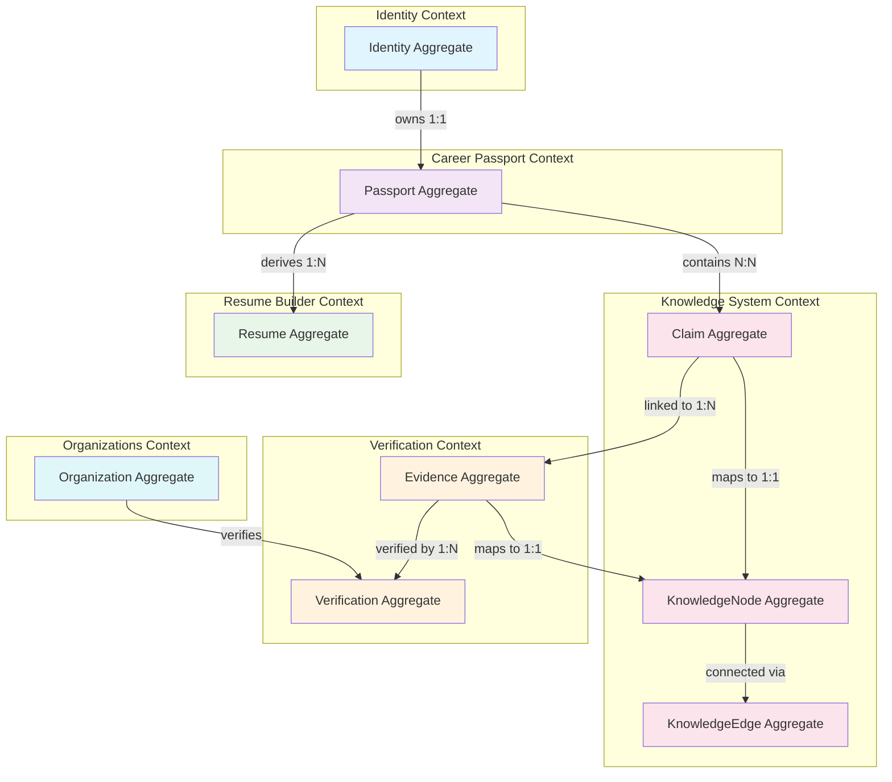

# Aggregates

## Purpose

This document defines the aggregate roots and consistency boundaries of the Patorbit domain model. Aggregates are transactional boundaries that ensure data consistency and enforce invariants. Each aggregate has a single root entity that acts as the entry point for all operations.

## Scope

This document covers all aggregate roots, their child entities, invariants, and root operations (commands).

---

## 1. Identity Aggregate

**Aggregate Root**: Identity

**Purpose**: Manages the lifecycle of a platform user. This aggregate is the outermost consistency boundary for authentication, authorization, and profile management.

**Child Entities**:

- Identity (root)
- AuthenticationMethod (OAuth, password, etc.)
- Profile
- RoleAssignment
- Session
- LinkedAccount (external provider links)

**Invariants**:

- An Identity must have at least one verified AuthenticationMethod before it can publish a Passport.
- An Identity cannot delete itself if it has active published Passports.
- An Identity cannot link the same external provider account more than once.
- An Identity's Status changes from `pending` to `active` only after email is verified.

**Commands**:

- `register(email, password)` — Creates identity with pending status, sends verification email.
- `verifyEmail(token)` — Confirms email, activates identity.
- `linkAccount(provider, externalId)` — Links an external auth provider.
- `updateProfile(profileData)` — Updates the profile.
- `addRole(role)` — Assigns a role to the identity.
- `deactivate(reason)` — Deactivates the identity, invalidating all sessions.
- `changeEmail(newEmail)` — Changes primary email, triggers re-verification.

**Transactions**:

- Registration must atomically create Identity + Profile + first AuthenticationMethod + create empty CareerPassport.
- Email verification must atomically update Identity status + emit `UserRegistered` event.
- Deactivation must atomically update status + invalidate sessions + emit `UserDeactivated`.

**Lifecycle**: Created → Verified → Active ↔ Suspended → Deactivated.

---

## 2. Passport Aggregate

**Aggregate Root**: CareerPassport

**Purpose**: Owns the canonical career record for an Identity. This aggregate manages the passport structure, claims collection, versioning, and publication.

**Child Entities**:

- CareerPassport (root)
- PassportVersion
- ClaimGroup (organizational grouping of claims)
- Timeline

**Referenced Entities (by ID)**:

- Claim (owned by Knowledge System context)
- Evidence (owned by Verification context)

**Invariants**:

- A Passport cannot be published without containing at least one Claim.
- Published Passport versions are immutable. No changes allowed.
- A Passport version can only be published if all included Claims have at least one referenced Evidence.
- The current version number must always be greater than the published version number.
- A Passport version cannot be deleted once published.

**Commands**:

- `addClaim(claimId)` — Adds a reference to a claim in the passport.
- `removeClaim(claimId)` — Removes a claim reference. Only allowed on draft versions.
- `createVersion()` — Creates a new immutability and freezes the current state. Returns the version number.
- `publish(versionNumber)` — Publishes a specific version, making it discoverable. Requires createVersion first.
- `archive()` — Archives the passport, invalidating all active share links.

**Transactions**:

- Publish must atomically freeze version + update passport status + emit `PassportPublished`.
- Adding a claim must validate the claim exists and belongs to this identity.

**Lifecycle**: Draft ↔ Published ↔ Archived.

---

## 3. Resume Aggregate

**Aggregate Root**: Resume

**Purpose**: Manages the creation, targeting, and export of targeted career documents derived from the Career Passport.

**Child Entities**:

- Resume (root)
- ResumeSection (ordered group of selected claims)
- ResumeVersion

**Referenced Entities (by ID)**:

- Claim (from CareerPassport)
- ResumeTemplate (from Resume Builder context)

**Invariants**:

- A Resume must reference at least one Claim organized into at least one Section.
- A Resume may only reference Claims that belong to the owner's Passport.
- Resume sections maintain an explicit ordering. Claims within a section also have ordering.
- A Resume version stores the exact set and ordering of claims at the time of generation.

**Commands**:

- `create(templateId)` — Creates a new resume based on a template.
- `addSection(name, claimIds)` — Adds a section with an ordered list of claims.
- `removeSection(sectionId)` — Removes a section and its claim references.
- `reorderSections(orderSequence)` — Reorders sections.
- `setTarget(target)` — Sets the resume target (role, industry, company).
- `generate()` — Renders the resume based on template and format configuration.
- `export(format)` — Exports to the specified format.

**Transactions**:

- Generation must atomically capture the current state of all referenced claims + create ResumeVersion + emit `ResumeGenerated`.

**Lifecycle**: Draft ↔ Configured → Generated ↔ Archived.

---

## 4. Claim Aggregate

**Aggregate Root**: Claim

**Purpose**: Manages the lifecycle of a single professional claim. This aggregate enforces invariants around claim state transitions and evidence linking.

**Child Entities**:

- Claim (root)

**Referenced Entities (by ID)**:

- Evidence (Verification context)
- KnowledgeNode (Knowledge System context)

**Invariants**:

- A Claim is immutable after creation. Corrections require creating a new Claim with a supersedes relationship.
- A Claim's status cannot transition from `verified` to `unverified` directly. The `disputed` state must be entered first.
- A Claim must have at least one Evidence node to transition from `unverified` to `pending`.
- A Claim must have at least one Verification with `verified` verdict to transition to `verified`.
- A Claim's temporal scope cannot be empty or invalid (end before start).

**Commands**:

- `submit(type, title, description, dateRange)` — Creates a new claim in `unverified` status.
- `linkEvidence(evidenceId)` — Links evidence to this claim. If evidence exists, status transitions to `pending`.
- `updateStatus(newStatus)` — Transitions status following the valid state machine.
- `supersede(newClaimId)` — Creates supersedes reference to a newer version of this claim.

**State Machine**:

**Lifecycle**: Unverified → Pending → Verified / Rejected ↔ Disputed ↔ Verified / Superseded.

---

## 5. Evidence Aggregate

**Aggregate Root**: Evidence

**Purpose**: Manages the lifecycle of evidence linked to a Claim, including its content, quality checks, and verification status.

**Child Entities**:

- Evidence (root)

**Referenced Entities (by ID)**:

- Claim (Knowledge System context)
- Verification (Verification context)

**Invariants**:

- Evidence content is immutable after acceptance. No updates allowed.
- Evidence cannot be linked to more than one Claim.
- Evidence of certain types (e.g., `document`) must pass automated quality checks before acceptance.
- Evidence must pass virus/malware scanning before content is accepted.

**Commands**:

- `submit(claimId, type, content)` — Submits evidence, runs quality checks.
- `accept()` — Marks evidence as accepted after quality checks pass.
- `reject(reason)` — Rejects evidence due to quality or authenticity failure.
- `requestVerification()` — Requests formal verification of this evidence.
- `challenge(reason)` — Challenges the evidence or its verification.

**Lifecycle**: Submitted → Accepted → Verified / Rejected ↔ Challenged.

---

## 6. Verification Aggregate

**Aggregate Root**: Verification

**Purpose**: Manages the verification process for a piece of Evidence. This aggregate handles request, assignment, verdict, and challenge workflows.

**Child Entities**:

- Verification (root)

**Referenced Entities (by ID)**:

- Evidence (Verification context)
- Verifier (Verification context)

**Invariants**:

- A Verifier cannot verify Evidence for which they are the subject or issuer.
- A Verifier can only have one active verification at a time per Evidence node.
- The verdict must be recorded with a Confidence Score.
- A Verification may be challenged within 30 days of completion.
- Once a Verification is completed, the verdict is final unless challenged.

**Commands**:

- `request(evidenceId)` — Creates a verification request.
- `assign(verifierId)` — Assigns a verifier to this request.
- `recordVerdict(verdict, confidence, notes)` — Records the verdict and completes verification.
- `challenge(reason)` — Challenges the recorded verdict.
- `resolveChallenge(outcome)` — Resolves the challenge, potentially updating the verdict.

**Lifecycle**: Requested → Assigned → In Progress → Completed ↔ Challenged → Resolved.

---

## 7. Organization Aggregate

**Aggregate Root**: Organization

**Purpose**: Manages the lifecycle of an organization, including verification, domain ownership, and credential issuance.

**Child Entities**:

- Organization (root)
- OrgDomain (verified domain)
- OrganizationSetting

**Referenced Entities (by ID)**:

- Workspace (separate aggregate root)
- OrganizationMember (separate aggregate root)

**Invariants**:

- An Organization must verify at least one domain before it can issue Credentials.
- Domain verification expires after 12 months.
- An Organization cannot be deleted if it has issued Credentials; it can only be deactivated.
- An Organization must have at least one Workspace.

**Commands**:

- `register(name, domain)` — Registers a new organization. Status is `registered`.
- `verifyDomain(domain, proofToken)` — Verifies domain ownership via DNS/email.
- `verifyLegal(documents)` — Submits legal documentation for enhanced verification.
- `addMember(identityId, role)` — Adds a member to the organization.
- `removeMember(identityId)` — Removes a member.
- `issueCredential(identityId, credentialType, metadata)` — Issues a credential to a member.
- `revokeCredential(credentialId)` — Revokes a previously issued credential.
- `deactivate(reason)` — Deactivates the organization.

**Lifecycle**: Registered → Domain Verified → Legally Verified → Active ↔ Suspended → Deactivated.

---

## 8. Knowledge Node Aggregate

**Aggregate Root**: KnowledgeNode

**Purpose**: Manages a single node in the Knowledge Graph. This aggregate ensures that all nodes have immutable provenance, clear ownership, and consistent state.

**Child Entities**:

- KnowledgeNode (root)
- ProvenanceRecord (immutable history of the node)
- NodeMetadata (type-specific attributes)

**Referenced Entities (by ID)**:

- KnowledgeEdge (separate aggregate root)
- Related KnowledgeNodes (by node ID)

**Invariants**:

- Every KnowledgeNode must have a complete provenance chain from its creation event.
- Provenance records are append-only and immutable after creation.
- A node's Trust Score is computed, not stored directly. The inputs to the computation are stored.
- A node cannot be deleted if it has any KnowledgeEdge referencing it. It can be deprecated.

**Commands**:

- `create(type, metadata)` — Creates a new node. Requires source provenance.
- `addProvenanceRecord(actor, action, details)` — Appends a provenance record.
- `link(targetNodeId, edgeType)` — Creates a KnowledgeEdge to another node.
- `deprecate(reason, replacementNodeId)` — Marks the node as deprecated.
- `computeTrustScore()` — Recalculates the node's trust score from its inputs.

**Lifecycle**: Active ⇄ Updated (multiple times) → Deprecated.

---

## 9. Knowledge Edge Aggregate

**Aggregate Root**: KnowledgeEdge

**Purpose**: Manages a typed relationship between two KnowledgeNodes. Edges give the Knowledge Graph its semantic meaning.

**Child Entities**:

- KnowledgeEdge (root)

**Invariants**:

- An Edge must reference valid, existing source and target nodes.
- An Edge must have a type from the defined relationship taxonomy.
- An Edge maintains temporal validity (validFrom, validUntil).
- An Edge is immutable after creation. Corrections require a new Edge.

**Commands**:

- `create(sourceNodeId, targetNodeId, edgeType, confidence, validPeriod)` — Creates a new edge.
- `setConfidence(score)` — Updates the edge's confidence score (only for computational edges).
- `extendValidity(newEndDate)` — Extends the temporal validity of the edge.

**Lifecycle**: Created → Updated (confidence/temporal) → Expired/Superseded.

---

## Aggregate Interaction Model

## References

- [Entities](entities.md): Entity definitions within each aggregate.
- [Domain Model](domain-model.md): Aggregate boundaries and cardinality.
- [Repositories](repositories.md): Repository interfaces for each aggregate root.
- [Domain Events](domain-events.md): Events emitted by aggregate commands.
