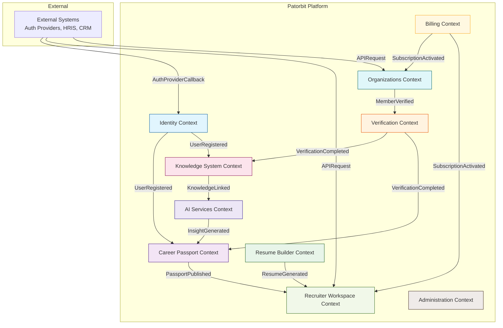
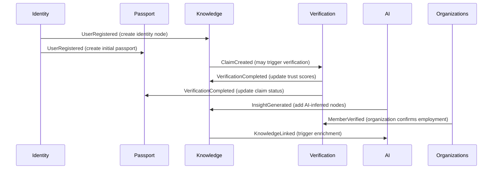

# Bounded Contexts

## Purpose

This document defines the bounded contexts of the Patorbit platform. Each bounded context represents a distinct domain boundary with its own ubiquitous language, owned data, and business logic. Contexts communicate exclusively through domain events, ensuring loose coupling and independent evolvability.

## Scope

This document covers all primary bounded contexts, their responsibilities, owned entities, published and consumed events, and external dependencies. The context map follows strategic Domain-Driven Design principles.

## Context Map Overview

## Context Descriptions

---

### 1. Identity Context

**Purpose**: Manage user identities, authentication, authorization, and profile information. The Identity Context is the entry point for all users and the foundation for all other contexts.

**Responsibilities**:

- User registration and authentication
- Identity verification (email, phone, government ID)
- Session management
- Role assignment
- Profile preferences and visibility settings
- Account recovery and deactivation

**Owned Entities**:

- Identity (aggregate root)
- User (aggregate root)
- AuthenticationMethod
- Session
- RoleAssignment
- ProfilePreferences
- LinkedAccount

**Published Events**:

- `UserRegistered`
- `UserAuthenticated`
- `IdentityVerified`
- `ProfileUpdated`
- `UserDeactivated`
- `RoleAssigned`

**Consumed Events**:

- `SubscriptionActivated` (from Billing — to upgrade role permissions)
- `OrganizationMembershipConfirmed` (from Organizations — to add organization role)

**External Dependencies**:

- Authentication providers (Google, LinkedIn, Microsoft, GitHub)
- Email verification service
- SMS gateway (for phone verification)
- Identity document verification provider (Know Your Customer / KYC)

---

### 2. Career Passport Context

**Purpose**: Own the Career Passport as the canonical representation of an individual's professional history. This context manages passport structure, versions, publications, and sharing.

**Responsibilities**:

- Career Passport creation and management
- Version management (snapshots, publishing, diff)
- Claim aggregation and organization
- Passport publication and sharing
- Passport verification status aggregation
- Export to multiple formats

**Owned Entities**:

- CareerPassport (aggregate root)
- PassportVersion
- PassportPublication
- ClaimGroup
- Timeline

**Published Events**:

- `PassportCreated`
- `PassportPublished`
- `PassportVersionCreated`
- `PassportShared`
- `PassportExported`
- `ClaimAddedToPassport`

**Consumed Events**:

- `UserRegistered` (from Identity — creates initial empty passport)
- `ClaimCreated` (from Knowledge System — to surface claims for inclusion)
- `VerificationCompleted` (from Verification — to update claim status in passport)
- `InsightGenerated` (from AI Services — to add AI-suggested claims)

**External Dependencies**:

- File storage for exported artifacts

---

### 3. Resume Builder Context

**Purpose**: Provide tools for creating tailored resumes derived from the Career Passport. This context handles templates, formatting, targeting, and export.

**Responsibilities**:

- Resume creation from passport claims
- Template management
- Resume targeting (role, industry, company)
- Format selection and export (PDF, HTML, JSON, DOCX)
- AI-assisted resume optimization

**Owned Entities**:

- Resume (aggregate root)
- ResumeTemplate
- ResumeSection
- ResumeVersion
- ResumeTarget

**Published Events**:

- `ResumeCreated`
- `ResumeGenerated`
- `ResumeExported`
- `ResumeTemplateApplied`

**Consumed Events**:

- `PassportPublished` (from Career Passport — resume can reference a published version)
- `InsightGenerated` (from AI Services — suggestions for resume optimization)

**External Dependencies**:

- PDF generation service
- DOCX generation service

---

### 4. Verification Context

**Purpose**: Manage the verification lifecycle for Claims and Evidence. This context is the engine of trust in the Patorbit platform, ensuring that claims are backed by authentic, verified evidence.

**Responsibilities**:

- Evidence submission processing
- Verification workflow orchestration
- Verifier management
- Automated verification (AI document analysis, email domain verification)
- Verification record storage
- Challenge and dispute handling

**Owned Entities**:

- Verification (aggregate root)
- Evidence (aggregate root)
- Verifier
- VerificationRecord
- Challenge
- VerifierAssignment

**Published Events**:

- `EvidenceSubmitted`
- `EvidenceAccepted`
- `EvidenceRejected`
- `VerificationRequested`
- `VerificationCompleted`
- `VerificationFailed`
- `ChallengeRaised`
- `ChallengeResolved`

**Consumed Events**:

- `ClaimCreated` (from Knowledge System — may trigger verification workflow)
- `MemberVerified` (from Organizations — organization-verified employment)
- `IdentityVerified` (from Identity — KYC verification)

**External Dependencies**:

- Document analysis AI service
- Email domain verification service
- Blockchain attestation service
- Third-party credential verification APIs (e.g., degree verification)

---

### 5. Knowledge System Context

**Purpose**: Maintain the Knowledge Graph — the interconnected network of Claims, Evidence, Identities, Organizations, and their relationships. This context provides query, traversal, and inference capabilities.

**Responsibilities**:

- Knowledge Graph creation and maintenance
- Claim creation and management
- Knowledge linking and relationship inference
- Graph traversal queries (for search, recommendations, analytics)
- Provenance tracking
- Node and edge lifecycle management

**Owned Entities**:

- KnowledgeNode (aggregate root)
- KnowledgeEdge (aggregate root)
- Claim
- ProvenanceRecord
- GraphQuery

**Published Events**:

- `ClaimCreated`
- `KnowledgeLinked`
- `KnowledgeNodeUpdated`
- `KnowledgeEdgeCreated`
- `GraphInferenceCompleted`

**Consumed Events**:

- `UserRegistered` (from Identity — create initial identity node)
- `VerificationCompleted` (from Verification — update claim node trust)
- `EvidenceSubmitted` (from Verification — add evidence node and link)
- `OrganizationVerified` (from Organizations — add organization node)
- `InsightGenerated` (from AI Services — add AI-derived nodes)

**External Dependencies**:

- Graph database
- Graph query engine

---

### 6. Organizations Context

**Purpose**: Manage organizations, their structure, memberships, and domain verification. Organizations are first-class participants in the trust ecosystem.

**Responsibilities**:

- Organization registration and verification
- Domain ownership verification
- Member management and role assignment
- Organization workspace management
- Organization trust scoring
- Credential issuance management

**Owned Entities**:

- Organization (aggregate root)
- Workspace (aggregate root)
- OrganizationMember
- OrgDomain
- OrgRole
- IssuerCredential

**Published Events**:

- `OrganizationRegistered`
- `OrganizationVerified`
- `MemberAdded`
- `MemberVerified`
- `MemberRoleChanged`
- `DomainVerified`
- `CredentialIssued`

**Consumed Events**:

- `SubscriptionActivated` (from Billing — enable premium features)
- `VerificationCompleted` (from Verification — update member verification status)

**External Dependencies**:

- Domain verification service (DNS, email)
- Business registry API (company verification)

---

### 7. Recruiter Workspace Context

**Purpose**: Provide recruiters with tools to discover, evaluate, and engage with talent. This context enables search, filtering, shortlisting, and communication.

**Responsibilities**:

- Candidate search and discovery
- Claim-based filtering and matching
- Candidate shortlisting and pipeline management
- Outreach and communication
- Team collaboration on hiring
- Integration with external ATS/HRIS systems

**Owned Entities**:

- RecruiterWorkspace (aggregate root)
- SearchQuery
- CandidateShortlist
- PipelineStage
- OutreachMessage
- TeamMember

**Published Events**:

- `SearchExecuted`
- `CandidateShortlisted`
- `OutreachSent`
- `PipelineStageChanged`
- `CandidateEngaged`

**Consumed Events**:

- `PassportPublished` (from Career Passport — discoverable candidates)
- `ResumeGenerated` (from Resume Builder — candidate materials updated)

**External Dependencies**:

- Email sending service
- ATS/HRIS integration APIs (Greenhouse, Lever, Workday)

---

### 8. AI Services Context

**Purpose**: Provide AI-powered capabilities across the platform. This context includes resume analysis, skill extraction, claim suggestions, matching, and insights.

**Responsibilities**:

- AI resume analysis and parsing
- Skill extraction and inference
- Claim suggestion from uploaded documents
- Resume optimization recommendations
- Candidate-job matching
- Career insight generation
- Anomaly detection in claims

**Owned Entities**:

- AIJob
- AIResult
- ModelVersion
- AIPrompt

**Published Events**:

- `InsightGenerated`
- `AnalysisCompleted`
- `SkillExtracted`
- `MatchScoreCalculated`
- `AnomalyDetected`

**Consumed Events**:

- `ClaimCreated` (from Knowledge System — for enrichment)
- `ResumeGenerated` (from Resume Builder — for optimization suggestions)
- `EvidenceSubmitted` (from Verification — for document analysis)

**External Dependencies**:

- LLM provider (Claude API)
- Document parsing service
- Embedding/vector service
- Model hosting infrastructure

---

### 9. Billing Context

**Purpose**: Manage subscriptions, invoicing, payments, and entitlements across the platform.

**Responsibilities**:

- Subscription plan management
- Payment processing
- Invoice generation
- Entitlement enforcement
- Usage tracking and metering
- Refund and credit processing

**Owned Entities**:

- Subscription (aggregate root)
- Plan
- Invoice
- Payment
- UsageRecord

**Published Events**:

- `SubscriptionActivated`
- `SubscriptionChanged`
- `SubscriptionCancelled`
- `PaymentProcessed`
- `PaymentFailed`
- `InvoiceGenerated`

**Consumed Events**:

- `UserRegistered` (from Identity — creates free tier subscription)
- `OrganizationRegistered` (from Organizations — creates organization subscription)

**External Dependencies**:

- Payment processor (Stripe)
- Tax calculation service
- Invoice generation service

---

### 10. Administration Context

**Purpose**: Provide platform administration, monitoring, audit, and support capabilities. This context is internal to the platform operator.

**Responsibilities**:

- Platform configuration
- User and organization management (admin actions)
- Audit log access
- Support ticket management
- Feature flags
- Platform health monitoring

**Owned Entities**:

- AdminAction
- AuditLog
- SupportTicket
- FeatureFlag
- PlatformConfiguration

**Published Events**:

- `AdminActionPerformed`
- `SupportTicketCreated`
- `SupportTicketResolved`
- `FeatureFlagChanged`

**Consumed Events**:

- All events (for audit logging)

**External Dependencies**:

- Monitoring infrastructure
- Support ticketing system

---

## Context Integration Patterns

### Event Flow Diagram

### Anti-Corruption Layer

Contexts that interact with external systems or legacy integrations maintain an anti-corruption layer to translate between the Patorbit ubiquitous language and external domain models:

- **Identity Context**: Translates between external auth provider schemas and the Patorbit identity model.
- **Verification Context**: Translates between external credential verification APIs and the internal evidence/verification model.
- **Recruiter Workspace Context**: Translates between ATS/HRIS data models and the Patorbit search and candidate model.

## Context Mapping

| Context             | Upstream Dependencies             | Downstream Consumers               |
| ------------------- | --------------------------------- | ---------------------------------- |
| Identity            | —                                 | Passport, Knowledge                |
| Career Passport     | Identity, Knowledge, Verification | Resume, Recruiter                  |
| Resume Builder      | Passport, AI                      | Recruiter                          |
| Verification        | Organizations, Identity           | Knowledge, Passport                |
| Knowledge System    | Identity, Verification, AI, Org   | Passport, AI, Recruiter            |
| Organizations       | Billing                           | Verification, Knowledge            |
| Recruiter Workspace | Passport, Resume                  | —                                  |
| AI Services         | Knowledge                         | Passport, Resume, Knowledge        |
| Billing             | —                                 | Organizations, Recruiter, Identity |
| Administration      | —                                 | —                                  |

## References

- [Ubiquitous Language](ubiquitous-language.md): Canonical vocabulary used across all contexts.
- [Domain Events](domain-events.md): Full event specifications.
- [Domain Model](domain-model.md): Entity relationships across contexts.
- [Workflows](workflows.md): Cross-context workflow orchestrations.
