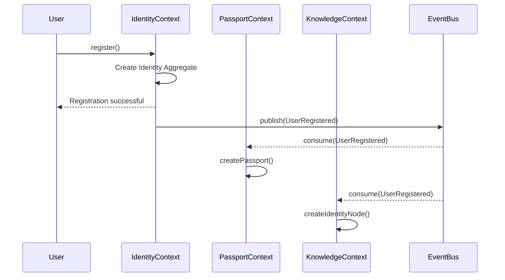

# Domain Events

## Purpose

This document defines the domain events for the Patorbit platform. Domain events are immutable facts about something that happened in the domain. They are the primary mechanism for communication between bounded contexts, ensuring loose coupling and enabling an event-driven architecture.

## Scope

This document covers all major domain events, their producers, potential consumers, payloads, and business meaning.

## Design Principles

- **Past Tense**: Event names are always in the past tense (e.g., `UserRegistered`).
- **Immutable**: Events are facts and cannot be changed.
- **Self-Contained**: Events contain all necessary information for consumers to act.
- **Granular**: Events are specific and focused on a single business fact.
- **Asynchronous**: Events are published to an event bus for asynchronous consumption.

---

## 1. Identity Context Events

### 1.1 UserRegistered

- **Producer**: Identity Aggregate
- **Consumers**: Passport Context, Knowledge System Context, Billing Context, Administration Context (for audit)
- **Payload**:
  - `identityId`: IdentityId
  - `email`: string
  - `name`: string
  - `registeredAt`: Timestamp
- **Business Meaning**: A new user has completed initial registration.
- **Event Flow**:

### 1.2 IdentityVerified

- **Producer**: Identity Aggregate
- **Consumers**: Verification Context, Passport Context
- **Payload**:
  - `identityId`: IdentityId
  - `method`: VerificationMethod (email, phone, kyc)
  - `verificationLevel`: VerificationLevel
  - `verifiedAt`: Timestamp
- **Business Meaning**: An identity has been verified to a certain level.

### 1.3 UserDeactivated

- **Producer**: Identity Aggregate
- **Consumers**: All contexts
- **Payload**:
  - `identityId`: IdentityId
  - `reason`: DeactivationReason
  - `deactivatedAt`: Timestamp
- **Business Meaning**: A user account has been deactivated. All sessions are invalidated.

---

## 2. Passport Context Events

### 2.1 PassportPublished

- **Producer**: Passport Aggregate
- **Consumers**: Recruiter Workspace, Resume Builder, AI Services
- **Payload**:
  - `passportId`: PassportId
  - `identityId`: IdentityId
  - `version`: VersionNumber
  - `publishedAt`: Timestamp
  - `visibility`: ProfileVisibility
- **Business Meaning**: A version of the passport is now public and discoverable.

### 2.2 PassportVersionCreated

- **Producer**: Passport Aggregate
- **Consumers**: Resume Builder, Administration Context
- **Payload**:
  - `passportId`: PassportId
  - `version`: VersionNumber
  - `createdAt`: Timestamp
  - `snapshotId`: SnapshotId
- **Business Meaning**: An immutable snapshot of the passport has been created.

---

## 3. Resume Builder Events

### 3.1 ResumeGenerated

- **Producer**: Resume Aggregate
- **Consumers**: Recruiter Workspace, AI Services
- **Payload**:
  - `resumeId`: ResumeId
  - `passportId`: PassportId
  - `identityId`: IdentityId
  - `target`: ResumeTarget
  - `format`: ExportFormat
  - `generatedAt`: Timestamp
- **Business Meaning**: A targeted resume has been generated and is ready for export or sharing.

---

## 4. Verification Context Events

### 4.1 EvidenceSubmitted

- **Producer**: Evidence Aggregate
- **Consumers**: Verification Service, Knowledge System, Administration Context
- **Payload**:
  - `evidenceId`: EvidenceId
  - `claimId`: ClaimId
  - `identityId`: IdentityId
  - `evidenceType`: EvidenceType
  - `submittedAt`: Timestamp
- **Business Meaning**: New evidence has been submitted for a claim.

### 4.2 VerificationCompleted

- **Producer**: Verification Aggregate
- **Consumers**: Knowledge System, Passport Context, Trust Engine
- **Payload**:
  - `verificationId`: VerificationId
  - `evidenceId`: EvidenceId
  - `claimId`: ClaimId
  - `verifierId`: VerifierId
  - `verdict`: Verdict
  - `confidence`: ConfidenceScore
  - `completedAt`: Timestamp
- **Business Meaning**: The verification process for a piece of evidence is complete. This is a critical event for trust updates.

---

## 5. Knowledge System Events

### 5.1 ClaimCreated

- **Producer**: Claim Aggregate
- **Consumers**: Verification Context, Passport Context, AI Services
- **Payload**:
  - `claimId`: ClaimId
  - `identityId`: IdentityId
  - `claimType`: ClaimType
  - `dateRange`: DateRange
  - `createdAt`: Timestamp
- **Business Meaning**: A new professional claim has been created.

### 5.2 KnowledgeLinked

- **Producer**: Knowledge Linking Service
- **Consumers**: AI Services, Trust Engine, Recruiter Workspace (for search indexing)
- **Payload**:
  - `edgeId`: KnowledgeEdgeId
  - `sourceNodeId`: NodeId
  - `targetNodeId`: NodeId
  - `edgeType`: EdgeType
  - `confidence`: ConfidenceScore
  - `linkedAt`: Timestamp
- **Business Meaning**: A new relationship has been established in the Knowledge Graph.

---

## 6. Organization Context Events

### 6.1 OrganizationVerified

- **Producer**: Organization Aggregate
- **Consumers**: Knowledge System, Verification Context
- **Payload**:
  - `organizationId`: OrganizationId
  - `verificationLevel`: OrgVerificationLevel
  - `verifiedAt`: Timestamp
- **Business Meaning**: An organization has achieved a new verification level, increasing its trust.

### 6.2 CredentialIssued

- **Producer**: Organization Aggregate
- **Consumers**: Knowledge System, Verification Context
- `credentialId`: CredentialId
- `issuerId`: OrganizationId
- `subjectId`: IdentityId
- `credentialType`: CredentialType
- `issuedAt`: Timestamp
- **Business Meaning**: An organization has issued a verifiable credential to an identity.

---

## 7. Trust & Confidence Events

### 7.1 TrustUpdated

- **Producer**: Trust Calculation Service
- **Consumers**: Confidence Engine, Recruiter Workspace, AI Services
- **Payload**:
  - `entityId`: (ClaimId, EvidenceId, etc.)
  - `entityType`: string
  - `newTrustScore`: TrustScore
  - `previousTrustScore`: TrustScore
  - `updatedAt`: Timestamp
- **Business Meaning**: The Trust Score for an entity has changed, requiring potential re-evaluation by consumers.

### 7.2 ConfidenceUpdated

- **Producer**: Confidence Engine
- **Consumers**: Passport Context, Recruiter Workspace, AI Services
- **Payload**:
  - `claimId`: ClaimId
  - `newConfidenceScore`: ConfidenceScore
  - `previousConfidenceScore`: ConfidenceScore
  - `updatedAt`: Timestamp
- **Business Meaning**: The Confidence Score for a claim has changed, affecting its display and filtering.

---

## 8. Billing Context Events

### 8.1 SubscriptionActivated

- **Producer**: Subscription Aggregate
- **Consumers**: Identity Context, Organizations Context, Recruiter Workspace
- **Payload**:
  - `subscriptionId`: SubscriptionId
  - `subscriberId`: (IdentityId or OrganizationId)
  - `planType`: PlanType
  - `activatedAt`: Timestamp
- **Business Meaning**: A subscription is now active, and entitlements should be applied.

## Event Delivery

- All events are published to a central, durable event bus (e.g., Kafka, RabbitMQ, AWS EventBridge).
- Each bounded context subscribes to the topics it is interested in.
- Consumers must be idempotent to handle potential duplicate event delivery.
- A dead-letter queue is used to handle events that fail to be processed after multiple retries.

## References

- [Bounded Contexts](bounded-contexts.md): Producers and consumers of events.
- [Workflows](workflows.md): Sequences of events that form business workflows.
- [Domain Services](domain-services.md): Services that produce events.
