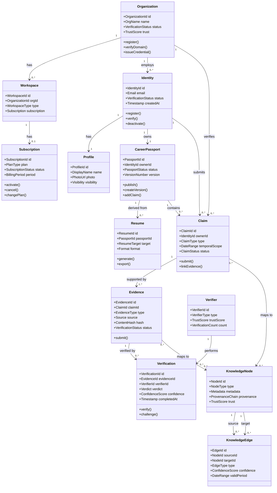

# Domain Model

## Purpose

This document defines the complete domain model for the Patorbit platform. It presents the primary entities, their relationships, cardinality constraints, business rules, and aggregate boundaries. The domain model is the structural foundation from which all implementation derives.

## Scope

This document covers all core domain entities across every bounded context, their attributes (key ones), inter-entity relationships, cardinality, and ownership semantics. It is the authoritative map of the domain's structural landscape.

## Conceptual Domain Model

## Entity Relationship Summary

| Entity         | Parent            | Children                       | Cardinality | Owning Context   |
| -------------- | ----------------- | ------------------------------ | ----------- | ---------------- |
| Identity       | —                 | Profile, CareerPassport, Claim | 1:N         | Identity         |
| Profile        | Identity          | —                              | 1:1         | Identity         |
| CareerPassport | Identity          | PassportVersion, ClaimGroup    | 1:N         | Career Passport  |
| Resume         | CareerPassport    | ResumeSection, ResumeVersion   | 1:N         | Resume Builder   |
| Claim          | Identity/Passport | Evidence                       | 1:N         | Knowledge System |
| Evidence       | Claim             | Verification                   | 1:N         | Verification     |
| Verification   | Evidence          | VerificationRecord             | 1:1         | Verification     |
| Organization   | —                 | Workspace, OrgMember           | 1:N         | Organizations    |
| Workspace      | Organization      | Subscription                   | 1:1         | Organizations    |
| Subscription   | Workspace         | Invoice, Payment               | 1:N         | Billing          |
| Verifier       | —                 | Verification                   | 1:N         | Verification     |
| KnowledgeNode  | —                 | KnowledgeEdge                  | 1:N         | Knowledge System |
| KnowledgeEdge  | KnowledgeNode     | —                              | N:N         | Knowledge System |

## Aggregate Boundaries

The domain is divided into the following aggregates, each with a well-defined root and consistency boundary:

| Aggregate Root | Children                                   | Invariant                                                      |
| -------------- | ------------------------------------------ | -------------------------------------------------------------- |
| Identity       | Profile, AuthenticationMethod, Preferences | Identity must have verified email before publishing            |
| CareerPassport | PassportVersion, ClaimGroup, Publication   | Passport versions are immutable once published                 |
| Resume         | ResumeSection, ResumeVersion, ResumeTarget | Resume must reference at least one claim from passport         |
| Claim          | Evidence (references)                      | Claim must have at least one evidence for verified status      |
| Evidence       | VerificationRecord                         | Evidence is immutable once accepted                            |
| Verification   | Verdict, VerificationRecord                | A verifier cannot verify their own evidence                    |
| Organization   | Workspace, OrgMember, OrgDomain            | Organization must have verified domain for credential issuance |
| Workspace      | Subscription, TeamMember                   | Workspace must have active subscription for premium features   |
| KnowledgeNode  | ProvenanceRecord                           | Every node has immutable provenance chain                      |
| KnowledgeEdge  | —                                          | Edge must reference valid source and target nodes              |

## Cardinality Constraints

1. **Identity to Profile**: Exactly one Profile per Identity. Created atomically with registration.
2. **Identity to CareerPassport**: Exactly one Passport per Identity. Created atomically with registration.
3. **CareerPassport to Resume**: Zero to many Resumes per Passport. Resumes are independent projections.
4. **Claim to Evidence**: A Claim must have at least one Evidence to achieve `verified` status. Zero Evidence is permitted for `unverified` Claims.
5. **Evidence to Verification**: An Evidence node may have zero or more Verifications. Zero means no verification has been requested yet.
6. **Organization to Workspace**: An Organization must have at least one Workspace. Created with registration.
7. **KnowledgeNode to KnowledgeEdge**: A Node may be source or target of zero to many Edges. Edges are optional.
8. **Verifier to Verification**: A Verifier may perform zero to many Verifications. Verifications are tied to a single Verifier.

## Business Rule Summary

1. **Claim Provenance**: Every Claim must trace back to its originating Identity. Claims are immutable after creation.
2. **Evidence Linking**: Evidence references exactly one Claim. Evidence cannot be relinked after submission.
3. **Verification Trust**: Verification performed by an organization-verified Verifier carries higher Trust weight than self-asserted or AI-only verification.
4. **Passport Versioning**: Publishing a Passport creates an immutable version. Corrections require a new version with supersedes link.
5. **Organization Verification**: An Organization must verify domain ownership (via DNS or email) before it can issue Credentials.
6. **Subscription Enforcement**: Feature access is enforced at the aggregate root level (Workspace, RecruiterWorkspace) based on Subscription state.

## References

- [Entities](entities.md): Detailed entity specifications.
- [Aggregates](aggregates.md): Aggregate root specifications with invariants.
- [Value Objects](value-objects.md): Immutable value objects referenced by entities.
- [Bounded Contexts](bounded-contexts.md): Context ownership boundaries.
