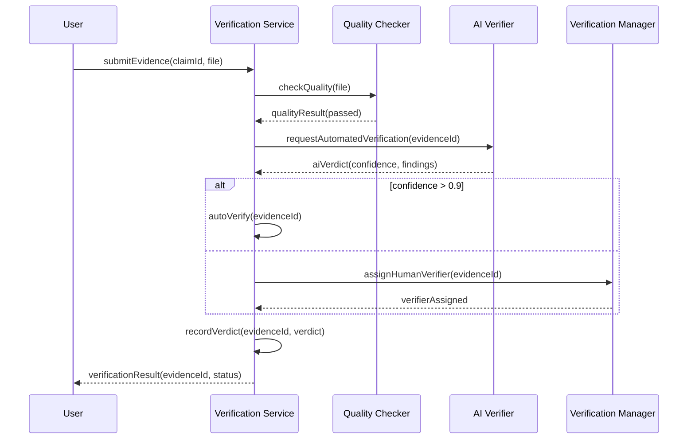
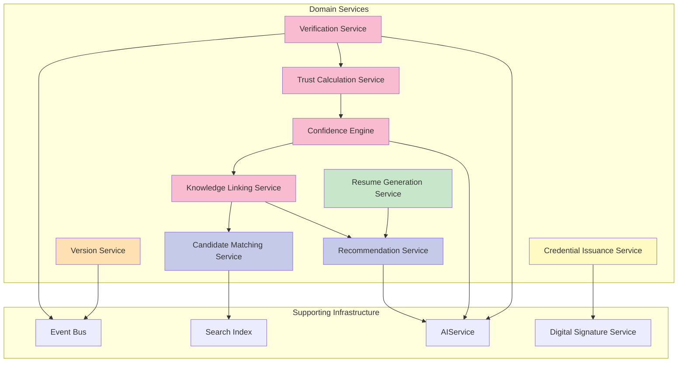

# Domain Services

## Purpose

This document defines the domain services within the Patorbit platform. Domain services encapsulate business logic that does not naturally fit within an entity or value object. They orchestrate operations across multiple aggregates and bounded contexts.

## Scope

This document covers all domain services, their responsibilities, interaction models, and relationship to aggregates and repositories.

## Design Principles

- **Stateless**: Domain services are stateless. All state is managed by entities and aggregates.
- **Cohesive**: Each service addresses a single concern.
- **Contextual**: Services operate within or across bounded context boundaries.
- **Injectable**: Services receive dependencies (repositories, other services, event buses) through their constructor.

---

## 1. Verification Service

**Context**: Verification

**Purpose**: Orchestrates the verification lifecycle for Claims and Evidence. This service manages the workflow from evidence submission through quality checks, verification assignment, verdict recording, and results propagation.

**Responsibilities**:

- Receive and validate evidence submissions.
- Route evidence to the appropriate verifier (AI, human, organization).
- Coordinate automated quality checks (file scanning, format validation, content hashing).
- Manage verification assignment and scheduling.
- Record verdicts and compute updated trust scores.
- Handle challenge and dispute workflows.
- Emit domain events for state changes.

**Interaction Model**:

**Key Methods**:

- `submitEvidence(claimId, evidenceType, content): EvidenceId`
- `requestVerification(evidenceId): VerificationId`
- `assignVerifier(verificationId, verifierId): AssignmentResult`
- `recordVerdict(verificationId, verdict, confidence): VerdictResult`
- `challengeVerification(verificationId, reason): ChallengeId`
- `resolveChallenge(challengeId, outcome): ResolutionResult`
- `getVerificationStatus(evidenceId): VerificationStatus`

**Dependencies**:

- `EvidenceRepository`
- `VerificationRepository`
- `ClaimRepository` (read-only, cross-context)
- `TrustCalculationService` (for score updates)
- `EventBus`

---

## 2. Resume Generation Service

**Context**: Resume Builder

**Purpose**: Generates formatted, targeted resumes from Career Passport data. This service handles template rendering, formatting, and export to multiple output formats.

**Responsibilities**:

- Select and order claims based on resume target.
- Apply template formatting (visual layout, styling).
- Filter claims based on confidence/trust thresholds.
- Generate output in multiple formats (PDF, HTML, JSON, DOCX).
- Optimize resume content for ATS compatibility.

**Key Methods**:

- `generateResume(resumeId): Resume`
- `exportResume(resumeId, format): ExportResult`
- `previewResume(resumeId): Preview`
- `suggestClaimsForResume(passportId, target): List<ClaimId>`

**Dependencies**:

- `ResumeRepository`
- `PassportRepository` (read-only)
- `ClaimRepository` (read-only, cross-context)
- `TemplateService`
- `ExportEngine`

---

## 3. Trust Calculation Service

**Context**: Trust Engine (cross-cutting)

**Purpose**: Computes and updates Trust Scores for entities across the platform. Trust Scores quantify the reliability of Claims, Evidence, Verifiers, and Organizations.

**Responsibilities**:

- Compute Trust Score for a Claim based on its Evidence.
- Compute Trust Score for an Evidence node based on its Verifications.
- Compute Trust Score for a Verifier based on historical accuracy.
- Compute Trust Score for an Organization based on verification level and history.
- Apply decay functions to Trust Scores over time.
- Propagate Trust Score changes through the Knowledge Graph.

**Key Methods**:

- `computeClaimTrustScore(claimId): TrustScore`
- `computeEvidenceTrustScore(evidenceId): TrustScore`
- `computeVerifierTrustScore(verifierId): TrustScore`
- `computeOrganizationTrustScore(organizationId): TrustScore`
- `propagateTrustUpdate(entityId): void`

**Trust Computation Factors**:

| Factor               | Description                                  | Weight |
| -------------------- | -------------------------------------------- | ------ |
| Verification Outcome | Number of passed vs failed verifications     | 0.40   |
| Verifier Trust       | Trust score of the verifiers                 | 0.25   |
| Evidence Quality     | Type and quality of supporting evidence      | 0.20   |
| Age                  | Recency of verification activity             | 0.10   |
| Consistency          | Consistency across multiple evidence sources | 0.05   |

**Dependencies**:

- `ClaimRepository`
- `EvidenceRepository`
- `VerificationRepository`
- `KnowledgeNodeRepository`
- `EventBus`

---

## 4. Confidence Engine

**Context**: Knowledge System (cross-cutting)

**Purpose**: Computes Confidence Scores for Claims, representing the system's certainty that a Claim is accurate. Confidence incorporates both Trust-derived and AI-derived signals.

**Responsibilities**:

- Compute composite Confidence Score from multiple factors.
- Incorporate AI analysis results into confidence.
- Weight evidence source credibility.
- Apply evidence age adjustments.
- Recompute confidence when new information arrives.

**Key Methods**:

- `computeClaimConfidence(claimId): ConfidenceScore`
- `computeEvidenceConfidence(evidenceId): ConfidenceScore`
- `computeKnowledgeGraphConfidence(nodeId): ConfidenceScore`
- `recomputeForIdentity(identityId): void`

**Confidence Computation Factors**:

| Factor             | Description                              | Weight |
| ------------------ | ---------------------------------------- | ------ |
| Trust Score        | Underlying trust from verification       | 0.30   |
| Evidence Quality   | Source credibility, evidence type weight | 0.20   |
| AI Confidence      | AI model's confidence in analysis        | 0.20   |
| Source Credibility | Issuer trust for credentials             | 0.15   |
| Age Recency        | Recency of evidence/verification         | 0.10   |
| Consistency        | Cross-referencing with multiple sources  | 0.05   |

**Dependencies**:

- `KnowledgeNodeRepository`
- `ClaimRepository`
- `EvidenceRepository`
- `AIService` (for AI confidence scores)
- `TrustCalculationService`
- `EventBus`

---

## 5. Knowledge Linking Service

**Context**: Knowledge System

**Purpose**: Creates and manages relationships (Knowledge Edges) between Knowledge Nodes. This service discovers and establishes connections between claims, evidence, identities, and organizations.

**Responsibilities**:

- Link Claims to their supporting Evidence.
- Link Claims to Organizations (employer, educator, issuer).
- Link Skills to Claims (skill used at a job).
- Detect and link duplicate or related Claims.
- Maintain edge confidence scores.
- Manage edge lifecycle (expiration, supersession).

**Key Methods**:

- `linkClaimToEvidence(claimId, evidenceId): KnowledgeEdge`
- `linkClaimToOrganization(claimId, organizationId, role): KnowledgeEdge`
- `linkSkillToClaim(skillNodeId, claimId, proficiency): KnowledgeEdge`
- `findRelatedClaims(claimId, maxDepth): List<Claim>`
- `detectAndLinkDuplicates(claimId): List<KnowledgeEdge>`
- `getClaimTimeline(identityId): List<KnowledgeEdge>`

**Dependencies**:

- `KnowledgeNodeRepository`
- `ClaimRepository`
- `OrganizationRepository`
- `AIService` (for duplicate detection and linking suggestions)

---

## 6. Recommendation Service

**Context**: AI Services

**Purpose**: Provides intelligent recommendations to users based on their Career Passport, activity, and platform knowledge.

**Responsibilities**:

- Suggest skills to add based on employment history.
- Recommend career paths based on similar profiles.
- Suggest claims the user may have forgotten to include.
- Recommend resume targets (roles, industries, companies).
- Recommend learning resources or certifications.

**Key Methods**:

- `suggestClaims(identityId): List<ClaimSuggestion>`
- `suggestSkills(passportId): List<SkillSuggestion>`
- `suggestResumeTargets(passportId): List<TargetSuggestion>`
- `suggestCareerPaths(identityId): List<PathSuggestion>`
- `getSimilarProfiles(identityId, limit): List<IdentitySummary>`

**Dependencies**:

- `KnowledgeNodeRepository` (graph traversal for similarity)
- `PassportRepository`
- `ClaimRepository`
- `AIService`

---

## 7. Version Service

**Context**: Career Passport

**Purpose**: Manages version creation, comparison, and publication for Career Passports and Resumes.

**Responsibilities**:

- Create snapshots of aggregates at specific points in time.
- Compute diffs between versions.
- Manage version numbering.
- Enforce immutability of published versions.
- Handle publication and unpublish workflows.

**Key Methods**:

- `createVersion(aggregateId, aggregateType): VersionNumber`
- `publishVersion(passportId, versionNumber): PublicationResult`
- `unpublishVersion(passportId): void`
- `diffVersions(passportId, fromVersion, toVersion): VersionDiff`
- `getVersionHistory(passportId): List<VersionSummary>`
- `restoreVersion(passportId, versionNumber): CareerPassport`

**Dependencies**:

- `PassportRepository`
- `ResumeRepository`
- `EventBus`

---

## 8. Credential Issuance Service

**Context**: Organizations

**Purpose**: Manages the issuance, verification, and revocation of digital credentials by Organizations.

**Responsibilities**:

- Validate issuer permissions and authority.
- Generate verifiable digital credentials.
- Sign credentials with organization digital signature.
- Distribute credentials to recipient identities.
- Handle credential revocation.
- Maintain credential registry.

**Key Methods**:

- `issueCredential(organizationId, identityId, credentialType, metadata): Credential`
- `revokeCredential(credentialId, reason): void`
- `verifyCredential(credentialId): CredentialStatus`
- `getIssuedCredentials(organizationId): List<Credential>`
- `getReceivedCredentials(identityId): List<Credential>`

**Dependencies**:

- `OrganizationRepository`
- `CredentialRepository`
- `DigitalSignatureService`
- `EventBus`

---

## 9. Candidate Matching Service

**Context**: Recruiter Workspace

**Purpose**: Matches recruiter search criteria against verified candidate data to surface qualified candidates.

**Responsibilities**:

- Parse recruiter search queries.
- Search across verified Claims for matching candidates.
- Rank candidates by relevance and confidence.
- Filter by trust and confidence thresholds.
- Provide match explanations.

**Key Methods**:

- `searchCandidates(criteria: SearchCriteria): Page<CandidateMatch>`
- `getMatchDetails(candidateId, recruiterId): MatchDetails`
- `rankByRelevance(candidates, criteria): List<CandidateMatch>`
- `explainMatch(candidateId, criteria): MatchExplanation`

**Dependencies**:

- `KnowledgeNodeRepository` (graph traversal for relationship-based matching)
- `PassportRepository`
- `SearchIndex`

---

## Domain Service Dependency Map

## References

- [Aggregates](aggregates.md): Aggregates operated on by domain services.
- [Domain Events](domain-events.md): Events emitted by domain services.
- [Workflows](workflows.md): End-to-end workflows orchestrated by domain services.
- [Trust Model](trust-model.md): Trust scoring algorithms.
- [Confidence Model](confidence-model.md): Confidence scoring algorithms.
