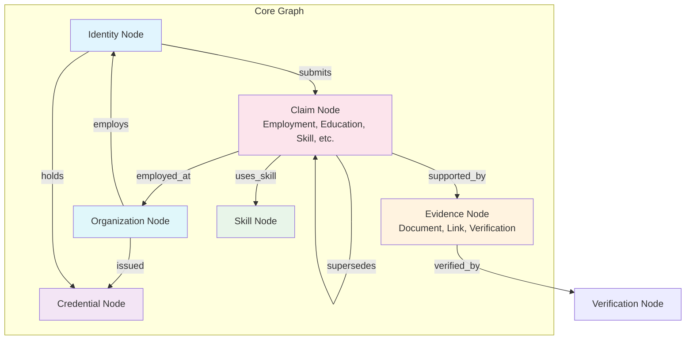
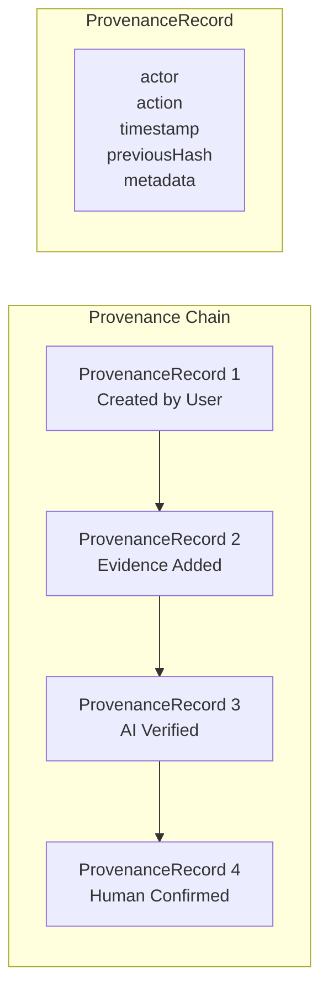

# Knowledge Graph

## Purpose

This document defines the Knowledge Graph within the Patorbit platform. The Knowledge Graph is the interconnected network of all career-related information: identities, claims, evidence, credentials, organizations, and the relationships between them. It is the foundation for search, recommendations, analytics, and AI-powered insights.

## Scope

This document covers node types, edge types, graph traversal rules, versioning, provenance, and evolution strategies.

---

## Overview

The Knowledge Graph models the Patorbit domain as a graph where:

- **Nodes** represent domain entities (persons, claims, evidence, organizations).
- **Edges** represent typed, directional relationships between nodes.
- **Properties** on nodes and edges carry attributes and metadata.
- **Provenance** on every node records its origin and history.



---

## Node Types

### Identity Node

**Purpose**: Represents a person or user within the platform.

**Properties**:

| Property            | Type       | Description                                      |
| ------------------- | ---------- | ------------------------------------------------ |
| `id`                | NodeId     | Globally unique graph node identifier            |
| `type`              | string     | Always `Identity`                                |
| `identityId`        | IdentityId | Reference to domain entity                       |
| `name`              | string     | Display name                                     |
| `creationTimestamp` | Timestamp  | When the node was created                        |
| `currentTrustScore` | float      | Computed trust score (0.0–1.0)                   |
| `status`            | string     | `active`, `suspended`, `deactivated`             |
| `verificationLevel` | string     | `unverified`, `email_verified`, `fully_verified` |

**Provenance**:

- Created on `UserRegistered` event.
- Updated on profile changes and verification events.
- Deactivation marks the node as `inactive` but preserves history.

### Claim Node

**Purpose**: Represents an atomic professional claim.

**Properties**:

| Property                 | Type            | Description                                                                                                  |
| ------------------------ | --------------- | ------------------------------------------------------------------------------------------------------------ |
| `id`                     | NodeId          | Globally unique graph node identifier                                                                        |
| `type`                   | string          | Always `Claim`                                                                                               |
| `claimId`                | ClaimId         | Reference to domain entity                                                                                   |
| `claimType`              | string          | `employment`, `education`, `certification`, `skill`, `achievement`, `project`, `publication`, `volunteering` |
| `title`                  | string          | Claim title                                                                                                  |
| `description`            | string          | Detailed description (optional)                                                                              |
| `startDate`              | Date            | Start of temporal scope                                                                                      |
| `endDate`                | Date (optional) | End of temporal scope                                                                                        |
| `status`                 | string          | `unverified`, `pending`, `verified`, `disputed`, `rejected`                                                  |
| `currentTrustScore`      | float           | Computed trust score                                                                                         |
| `currentConfidenceScore` | float           | Computed confidence score                                                                                    |

**Provenance**:

- Created on `ClaimCreated` event.
- Trust and confidence scores recomputed on verification and evidence events.
- Superseded claims link to their replacements.

### Evidence Node

**Purpose**: Represents a piece of evidence supporting or refuting a claim.

**Properties**:

| Property            | Type       | Description                                                                                        |
| ------------------- | ---------- | -------------------------------------------------------------------------------------------------- |
| `id`                | NodeId     | Globally unique identifier                                                                         |
| `type`              | string     | Always `Evidence`                                                                                  |
| `evidenceId`        | EvidenceId | Reference to domain entity                                                                         |
| `evidenceType`      | string     | `document`, `link`, `email_verification`, `api`, `blockchain`, `ai_extraction`, `peer_endorsement` |
| `contentHash`       | string     | Cryptographic hash of content                                                                      |
| `status`            | string     | `submitted`, `accepted`, `verified`, `rejected`, `challenged`                                      |
| `sourceCredibility` | float      | Source credibility score                                                                           |

### Organization Node

**Purpose**: Represents an organization within the platform.

**Properties**:

| Property            | Type           | Description                                         |
| ------------------- | -------------- | --------------------------------------------------- |
| `id`                | NodeId         | Globally unique identifier                          |
| `type`              | string         | Always `Organization`                               |
| `organizationId`    | OrganizationId | Reference to domain entity                          |
| `name`              | string         | Organization name                                   |
| `domain`            | string         | Primary email domain                                |
| `verificationLevel` | string         | `registered`, `domain_verified`, `legally_verified` |
| `trustScore`        | float          | Organizational trust score                          |
| `industry`          | string         | Primary industry                                    |

### Skill Node

**Purpose**: Represents a professional skill or competency. Skills are defined globally and linked to claims.

**Properties**:

| Property         | Type     | Description                  |
| ---------------- | -------- | ---------------------------- |
| `id`             | NodeId   | Globally unique identifier   |
| `type`           | string   | Always `Skill`               |
| `name`           | string   | Skill name                   |
| `normalizedName` | string   | Normalized name for matching |
| `category`       | string   | Skill category               |
| `aliases`        | string[] | Alternate names or synonyms  |

**Provenance**:

- Skills are seeded from a global taxonomy.
- New skills can be created as user-generated content expands the taxonomy.
- Skill merging may occur for duplicates.

### Credential Node

**Purpose**: Represents a verifiable credential issued by an organization.

**Properties**:

| Property         | Type            | Description                                                 |
| ---------------- | --------------- | ----------------------------------------------------------- |
| `id`             | NodeId          | Globally unique identifier                                  |
| `type`           | string          | Always `Credential`                                         |
| `credentialId`   | CredentialId    | Reference to domain entity                                  |
| `credentialType` | string          | `degree`, `certification`, `license`, `badge`, `membership` |
| `title`          | string          | Credential name                                             |
| `issuerOrgId`    | OrganizationId  | Issuing organization                                        |
| `issuedAt`       | Date            | Date of issuance                                            |
| `expiresAt`      | Date (optional) | Expiry date                                                 |
| `status`         | string          | `active`, `expired`, `revoked`, `suspended`                 |

---

## Edge Types

| Edge Type      | Source       | Target       | Description                              | Properties                                 |
| -------------- | ------------ | ------------ | ---------------------------------------- | ------------------------------------------ |
| `submits`      | Identity     | Claim        | Identity owns a claim                    | `createdAt`, `confidence`                  |
| `supported_by` | Claim        | Evidence     | Claim is supported by evidence           | `addedAt`, `confidence`                    |
| `verified_by`  | Evidence     | Verification | Evidence verification record             | `verdict`, `confidence`, `completedAt`     |
| `employed_at`  | Claim        | Organization | Employment claim references organization | `role`, `department`                       |
| `educated_at`  | Claim        | Organization | Education claim references institution   | `field`, `degree`                          |
| `uses_skill`   | Claim        | Skill        | Employment/achievement uses a skill      | `proficiency` (claimed), `confidence`      |
| `employs`      | Organization | Identity     | Employment relationship                  | `role`, `startDate`, `endDate`, `verified` |
| `issued`       | Organization | Credential   | Organization issued a credential         | `issuedAt`, `credentialType`               |
| `holds`        | Identity     | Credential   | Identity holds a credential              | `acquiredAt`                               |
| `supersedes`   | Claim        | Claim        | A newer claim replaces an older one      | `reason`, `supersededAt`                   |
| `related_to`   | Claim        | Claim        | Related claims                           | `relationshipType`, `strength`             |
| `endorses`     | Identity     | Skill        | Peer endorsement of a skill              | `endorsedAt`, `confidence`                 |

---

## Traversal Rules

The Knowledge Graph supports the following traversal patterns:

**Pattern 1: Identity Career History**

```
Identity → submits → Claim → employed_at → Organization
Identity → submits → Claim → uses_skill → Skill
```

Returns the complete career history of an identity, including organizations and skills.

**Pattern 2: Verification Chain**

```
Claim → supported_by → Evidence → verified_by → Verification
```

Returns the full verification trail for a claim, including all evidence and their verification records.

**Pattern 3: Organization Talent**

```
Organization ← employs ← Identity ← submits → Claim → uses_skill → Skill
```

Returns all verified talent within an organization, filtered by skill, role, or tenure.

**Pattern 4: Skill Adoption (Market Intelligence)**

```
Skill ← uses_skill ← Claim ← submits ← Identity ← employs → Organization
```

Returns which organizations have employees claiming a specific skill, enabling workforce analytics.

**Pattern 5: Claim Confidence Assessment**

```
Claim ← supported_by → Evidence → verified_by → Verification
Claim ← supersedes → Claim (previous)
```

Returns all information needed to compute the Claim's combined Trust and Confidence scores.

---

## Graph Query Interfaces

The graph exposes the following query primitives:

| Query          | Input                     | Output                      | Description                                                            |
| -------------- | ------------------------- | --------------------------- | ---------------------------------------------------------------------- |
| `getNode`      | NodeId                    | Single node with properties | Retrieves a single node by ID.                                         |
| `getNeighbors` | NodeId, EdgeType[]        | List of nodes and edges     | Gets all nodes connected by specified edge types.                      |
| `traverse`     | NodeId, EdgeType[], depth | List of paths               | BFS/DFS traversal up to a depth limit.                                 |
| `findPaths`    | NodeId, NodeId, maxDepth  | List of paths               | Find paths between two nodes.                                          |
| `query`        | GraphQuery                | Result set                  | Expressive query using a query builder or native graph query language. |

---

## Graph Evolution

### Versioning

- Nodes are versioned via provenance records. Each modification produces a new provenance record.
- The latest version is always the "current" state. Historical versions are accessible through the provenance chain.
- Edges are immutable once created. Edge corrections create new edges that supersede old ones.

### Temporal Queries

The graph supports time-travel queries to view the state of a subgraph at a specific point in time:

```
getSubgraphAt(centerNodeId, depth, timestamp)
```

This is critical for:

- Audit: "What information was visible when the passport was published?"
- Compliance: "What was the trust status of this claim at the time of verification?"
- Analytics: "How has a skill's adoption grown over time?"

### Evolution Strategies

| Strategy              | Description                        | Trigger                                    |
| --------------------- | ---------------------------------- | ------------------------------------------ |
| **Node addition**     | New nodes added from user activity | User events, AI enrichment                 |
| **Edge creation**     | New relationships established      | Claim creation, verification, AI inference |
| **Property updates**  | Node/edge properties change        | Trust updates, status changes              |
| **Edge supersession** | Old edge deprecated by new edge    | Corrections, relationship updates          |
| **Node deprecation**  | Node marked as deprecated          | Identity deactivation, claim supersession  |
| **Skill merging**     | Duplicate skill nodes merged       | Admin action or automated detection        |

---

## Provenance Architecture

Every graph mutation records provenance:



Each provenance record captures:

- `actor`: The entity that performed the action (identity, system, AI service).
- `action`: The type of action performed.
- `timestamp`: When the action occurred.
- `previousHash`: Cryptographic hash of the previous record (chaining).
- `metadata`: Action-specific details.

---

## Domain-to-Graph Mapping

| Domain Entity      | Graph Node Type | Graph Node Type (Alternative) |
| ------------------ | --------------- | ----------------------------- |
| Identity           | Identity        | —                             |
| Claim (Employment) | Claim           | with `claimType=employment`   |
| Claim (Education)  | Claim           | with `claimType=education`    |
| Claim (Skill)      | Claim           | with `claimType=skill`        |
| Evidence           | Evidence        | —                             |
| Organization       | Organization    | —                             |
| Credential         | Credential      | —                             |
| Skill              | Skill           | —                             |
| Verification       | Verification    | stored as edge property       |

## References

- [Domain Model](domain-model.md): Entity relationships for the Knowledge Graph.
- [Trust Model](trust-model.md): How trust scores propagate through the graph.
- [Confidence Model](confidence-model.md): How confidence scores are computed using graph data.
- [Domain Services](domain-services.md): Services that maintain the Knowledge Graph.
- [Entities](entities.md): Entity specifications for nodes.
