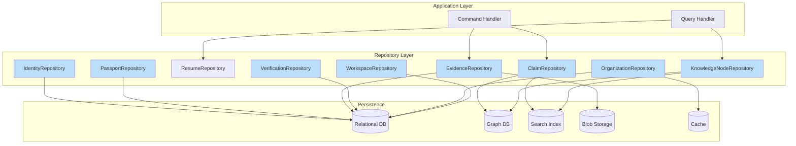

# Repositories

## Purpose

This document defines the repository interfaces for the Patorbit domain. Repositories provide persistence-agnostic access to aggregate roots, encapsulating the logic for retrieving and storing aggregates. Each aggregate root has a dedicated repository interface.

## Scope

This document covers all repository interfaces, their responsibilities, query contracts, command contracts, and design considerations.

## Design Principles

- **Persistence Agnosticism**: Repository interfaces make no assumptions about underlying storage technology (relational, document, graph, etc.).
- **Aggregate Scope**: Each repository manages exactly one aggregate root type. Operations on related entities happen through the root.
- **Consistency**: Writes are transactional at the aggregate boundary. Repositories can assume strong consistency within a single aggregate.
- **Identity**: Repositories use domain identity types, not database-generated IDs.
- **Query Optimization**: Read-side optimizations (denormalized views, read models) are separate from repositories and are not specified here.

---

## 1. IdentityRepository

**Purpose**: Persists and retrieves Identity aggregates.

**Owner**: Identity Context

**Aggregate Root**: Identity

**Queries**:

| Query                    | Parameters                             | Returns                 | Description                                                                      |
| ------------------------ | -------------------------------------- | ----------------------- | -------------------------------------------------------------------------------- |
| `findById`               | `identityId: IdentityId`               | `Optional<Identity>`    | Find by primary identifier.                                                      |
| `findByEmail`            | `email: Email`                         | `Optional<Identity>`    | Find by verified email.                                                          |
| `findByExternalProvider` | `provider: string, externalId: string` | `Optional<Identity>`    | Find by linked external account.                                                 |
| `existsByEmail`          | `email: Email`                         | `boolean`               | Check if email is already registered.                                            |
| `findByStatus`           | `status: IdentityStatus, page, size`   | `Page<Identity>`        | Find identities by status (admin use).                                           |
| `search`                 | `criteria: IdentitySearchCriteria`     | `Page<IdentitySummary>` | Search identities by name, email, or other criteria. Returns summary projection. |

**Commands**:

| Command            | Parameters                                     | Returns    | Description                                               |
| ------------------ | ---------------------------------------------- | ---------- | --------------------------------------------------------- |
| `save`             | `identity: Identity`                           | `Identity` | Persist a new or modified identity aggregate.             |
| `delete`           | `identityId: IdentityId`                       | `void`     | Hard-delete an identity (only if no published passports). |
| `updateLastActive` | `identityId: IdentityId, timestamp: Timestamp` | `void`     | Optimistically update last active timestamp.              |

**Caching Considerations**:

- Identity aggregates are read frequently (on every authenticated request) but written infrequently. A distributed cache with short TTL (5 minutes) is recommended.
- Cache invalidation should occur on `profileUpdated`, `emailChanged`, `statusChanged` events.
- Session data should be cached separately from identity data.

---

## 2. PassportRepository

**Purpose**: Persists and retrieves Career Passport aggregates.

**Owner**: Career Passport Context

**Aggregate Root**: CareerPassport

**Queries**:

| Query                  | Parameters                         | Returns                    | Description                                    |
| ---------------------- | ---------------------------------- | -------------------------- | ---------------------------------------------- |
| `findById`             | `passportId: PassportId`           | `Optional<CareerPassport>` | Find by primary identifier.                    |
| `findByIdentityId`     | `identityId: IdentityId`           | `Optional<CareerPassport>` | Find the passport belonging to an identity.    |
| `findPublishedBetween` | `from: Date, to: Date, page, size` | `Page<PassportSummary>`    | Find passports published in a date range.      |
| `findByClaimId`        | `claimId: ClaimId`                 | `Optional<CareerPassport>` | Find the passport containing a specific claim. |
| `existsByIdentityId`   | `identityId: IdentityId`           | `boolean`                  | Check if identity has a passport.              |

**Commands**:

| Command       | Parameters                 | Returns           | Description                         |
| ------------- | -------------------------- | ----------------- | ----------------------------------- |
| `save`        | `passport: CareerPassport` | `CareerPassport`  | Persist a new or modified passport. |
| `saveVersion` | `version: PassportVersion` | `PassportVersion` | Persist a new passport version.     |

**Caching Considerations**:

- Published passport versions are read-heavy and write-infrequent. Cache published versions aggressively.
- Draft passports should be cached with shorter TTL or not cached at all.
- Passport summaries for recruiter search benefit from a search index (e.g., Elasticsearch).

---

## 3. ResumeRepository

**Purpose**: Persists and retrieves Resume aggregates.

**Owner**: Resume Builder Context

**Aggregate Root**: Resume

**Queries**:

| Query              | Parameters                           | Returns            | Description                      |
| ------------------ | ------------------------------------ | ------------------ | -------------------------------- |
| `findById`         | `resumeId: ResumeId`                 | `Optional<Resume>` | Find by primary identifier.      |
| `findByPassportId` | `passportId: PassportId, page, size` | `Page<Resume>`     | Find all resumes for a passport. |
| `findByTarget`     | `target: ResumeTarget, page, size`   | `Page<Resume>`     | Find resumes by target criteria. |

**Commands**:

| Command  | Parameters           | Returns  | Description                       |
| -------- | -------------------- | -------- | --------------------------------- |
| `save`   | `resume: Resume`     | `Resume` | Persist a new or modified resume. |
| `delete` | `resumeId: ResumeId` | `void`   | Delete a resume (draft only).     |

---

## 4. ClaimRepository

**Purpose**: Persists and retrieves Claim aggregates.

**Owner**: Knowledge System Context

**Aggregate Root**: Claim

**Queries**:

| Query                     | Parameters                                     | Returns           | Description                              |
| ------------------------- | ---------------------------------------------- | ----------------- | ---------------------------------------- |
| `findById`                | `claimId: ClaimId`                             | `Optional<Claim>` | Find by primary identifier.              |
| `findByIdentityId`        | `identityId: IdentityId, page, size`           | `Page<Claim>`     | Find all claims for an identity.         |
| `findByType`              | `type: ClaimType, identityId: IdentityId`      | `List<Claim>`     | Find claims of a specific type.          |
| `findByStatus`            | `status: ClaimStatus, page, size`              | `Page<Claim>`     | Find claims by verification status.      |
| `findByDateRange`         | `from: Date, to: Date, identityId: IdentityId` | `List<Claim>`     | Find claims within a date range.         |
| `findByOrganization`      | `organizationId: OrganizationId, page, size`   | `Page<Claim>`     | Find claims referencing an organization. |
| `findPendingVerification` | `limit: int`                                   | `List<Claim>`     | Find claims needing verification.        |
| `searchClaims`            | `criteria: ClaimSearchCriteria`                | `Page<Claim>`     | Full-text search of claims.              |

**Commands**:

| Command   | Parameters            | Returns       | Description                      |
| --------- | --------------------- | ------------- | -------------------------------- |
| `save`    | `claim: Claim`        | `Claim`       | Persist a new or modified claim. |
| `saveAll` | `claims: List<Claim>` | `List<Claim>` | Batch persist claims.            |

**Persistence Notes**:

- Claims are accessed as nodes in the Knowledge Graph. The primary persistence for claims is the graph database.
- Relational projections may be maintained for efficient querying by type, status, or date range.
- The `searchClaims` query may be backed by a full-text search index.

---

## 5. EvidenceRepository

**Purpose**: Persists and retrieves Evidence aggregates.

**Owner**: Verification Context

**Aggregate Root**: Evidence

**Queries**:

| Query               | Parameters                           | Returns              | Description                                        |
| ------------------- | ------------------------------------ | -------------------- | -------------------------------------------------- |
| `findById`          | `evidenceId: EvidenceId`             | `Optional<Evidence>` | Find by primary identifier.                        |
| `findByClaimId`     | `claimId: ClaimId`                   | `List<Evidence>`     | Find all evidence for a claim.                     |
| `findByStatus`      | `status: EvidenceStatus, page, size` | `Page<Evidence>`     | Find evidence by status.                           |
| `findByType`        | `type: EvidenceType, page, size`     | `Page<Evidence>`     | Find evidence by type.                             |
| `findByVerifier`    | `verifierId: VerifierId, page, size` | `Page<Evidence>`     | Find evidence verified by a verifier.              |
| `countByClaimId`    | `claimId: ClaimId`                   | `int`                | Count evidence nodes for a claim.                  |
| `findExpired`       | `before: Date, page, size`           | `Page<Evidence>`     | Find expired evidence needing refresh.             |
| `findByContentHash` | `hash: ContentHash`                  | `Optional<Evidence>` | Find by content hash. Important for deduplication. |

**Commands**:

| Command         | Parameters                                         | Returns    | Description                              |
| --------------- | -------------------------------------------------- | ---------- | ---------------------------------------- |
| `save`          | `evidence: Evidence`                               | `Evidence` | Persist a new or modified evidence.      |
| `saveContent`   | `evidenceId: EvidenceId, content: EvidenceContent` | `void`     | Persist binary/content data.             |
| `deleteContent` | `evidenceId: EvidenceId`                           | `void`     | Delete evidence content (for rejection). |

**Persistence Notes**:

- Evidence content (documents, images) should be stored in blob storage, not in the primary database.
- The repository manages metadata in the database and content references to the blob store.
- Content hashing is used for deduplication (same file uploaded for multiple claims).
- Virus scanning results are stored alongside evidence metadata.

---

## 6. VerificationRepository

**Purpose**: Persists and retrieves Verification aggregates.

**Owner**: Verification Context

**Aggregate Root**: Verification

**Queries**:

| Query               | Parameters                           | Returns                  | Description                          |
| ------------------- | ------------------------------------ | ------------------------ | ------------------------------------ |
| `findById`          | `verificationId: VerificationId`     | `Optional<Verification>` | Find by primary identifier.          |
| `findByEvidenceId`  | `evidenceId: EvidenceId`             | `List<Verification>`     | Find all verifications for evidence. |
| `findByVerifierId`  | `verifierId: VerifierId, page, size` | `Page<Verification>`     | Find verifications by verifier.      |
| `findByVerdict`     | `verdict: Verdict, page, size`       | `Page<Verification>`     | Find verifications by outcome.       |
| `findPending`       | `page, size`                         | `Page<Verification>`     | Find verifications awaiting action.  |
| `findByDateRange`   | `from: Date, to: Date`               | `List<Verification>`     | Find verifications in a date range.  |
| `countByVerifierId` | `verifierId: VerifierId`             | `int`                    | Count verifications for a verifier.  |

**Commands**:

| Command         | Parameters                                                            | Returns        | Description                             |
| --------------- | --------------------------------------------------------------------- | -------------- | --------------------------------------- |
| `save`          | `verification: Verification`                                          | `Verification` | Persist a new or modified verification. |
| `recordVerdict` | `verificationId: VerificationId, verdict: Verdict, confidence: float` | `void`         | Optimistically update the verdict.      |

---

## 7. KnowledgeNodeRepository

**Purpose**: Persists and retrieves KnowledgeNode aggregates.

**Owner**: Knowledge System Context

**Aggregate Root**: KnowledgeNode

**Queries**:

| Query            | Parameters                                            | Returns                     | Description                       |
| ---------------- | ----------------------------------------------------- | --------------------------- | --------------------------------- |
| `findById`       | `nodeId: NodeId`                                      | `Optional<KnowledgeNode>`   | Find by primary identifier.       |
| `findByType`     | `type: NodeType, page, size`                          | `Page<KnowledgeNode>`       | Find nodes by type.               |
| `findBySourceId` | `sourceId: string, page, size`                        | `List<KnowledgeNode>`       | Find nodes by source domain ID.   |
| `findNeighbors`  | `nodeId: NodeId, edgeType: EdgeType, depth: int`      | `List<KnowledgeNode>`       | Find neighboring nodes via edges. |
| `findPath`       | `fromNodeId: NodeId, toNodeId: NodeId, maxDepth: int` | `List<List<KnowledgeNode>>` | Find paths between two nodes.     |
| `searchNodes`    | `criteria: NodeSearchCriteria, page, size`            | `Page<KnowledgeNode>`       | Full-text search across nodes.    |

**Commands**:

| Command               | Parameters                                 | Returns               | Description                     |
| --------------------- | ------------------------------------------ | --------------------- | ------------------------------- |
| `save`                | `node: KnowledgeNode`                      | `KnowledgeNode`       | Persist a new or modified node. |
| `saveAll`             | `nodes: List<KnowledgeNode>`               | `List<KnowledgeNode>` | Batch persist nodes.            |
| `addProvenanceRecord` | `nodeId: NodeId, record: ProvenanceRecord` | `void`                | Append a provenance record.     |

**Persistence Notes**:

- This repository wraps the graph database. Graph traversal queries are first-class citizens.
- Full-text search may be delegated to a search index.
- Node metadata may be stored as properties on the graph node.

---

## 8. OrganizationRepository

**Purpose**: Persists and retrieves Organization aggregates.

**Owner**: Organizations Context

**Aggregate Root**: Organization

**Queries**:

| Query                 | Parameters                       | Returns                  | Description                                    |
| --------------------- | -------------------------------- | ------------------------ | ---------------------------------------------- |
| `findById`            | `organizationId: OrganizationId` | `Optional<Organization>` | Find by primary identifier.                    |
| `findByDomain`        | `domain: Domain`                 | `Optional<Organization>` | Find by verified domain.                       |
| `findByStatus`        | `status: OrgStatus, page, size`  | `Page<Organization>`     | Find organizations by status.                  |
| `findByIndustry`      | `industry: string, page, size`   | `Page<Organization>`     | Find by industry.                              |
| `searchOrganizations` | `criteria: OrgSearchCriteria`    | `Page<Organization>`     | Search by name, domain, or industry.           |
| `findByMember`        | `identityId: IdentityId`         | `List<Organization>`     | Find organizations where identity is a member. |

**Commands**:

| Command  | Parameters                       | Returns        | Description                                  |
| -------- | -------------------------------- | -------------- | -------------------------------------------- |
| `save`   | `organization: Organization`     | `Organization` | Persist a new or modified organization.      |
| `delete` | `organizationId: OrganizationId` | `void`         | Hard-delete (only if no credentials issued). |

**Caching Considerations**:

- Organizations are read frequently (for every claim verification lookup) but updated infrequently.
- Cache organization aggregates with a 10-minute TTL.
- Domain-to-Organization mapping should be cached aggressively.

---

## 9. WorkspaceRepository

**Purpose**: Persists and retrieves Workspace aggregates.

**Owner**: Organizations Context

**Aggregate Root**: Workspace

**Queries**:

| Query                      | Parameters                           | Returns               | Description                                 |
| -------------------------- | ------------------------------------ | --------------------- | ------------------------------------------- |
| `findById`                 | `workspaceId: WorkspaceId`           | `Optional<Workspace>` | Find by primary identifier.                 |
| `findByOrganizationId`     | `organizationId: OrganizationId`     | `List<Workspace>`     | Find all workspaces for an organization.    |
| `findByMember`             | `identityId: IdentityId, page, size` | `Page<Workspace>`     | Find workspaces where identity is a member. |
| `findBySubscriptionStatus` | `status: SubscriptionStatus`         | `List<Workspace>`     | Find workspaces by subscription status.     |

**Commands**:

| Command  | Parameters                 | Returns     | Description                          |
| -------- | -------------------------- | ----------- | ------------------------------------ |
| `save`   | `workspace: Workspace`     | `Workspace` | Persist a new or modified workspace. |
| `delete` | `workspaceId: WorkspaceId` | `void`      | Delete workspace.                    |

---

## Repository Interaction Model

## References

- [Aggregates](aggregates.md): Aggregate roots that each repository manages.
- [Entities](entities.md): Entity types persisted through repositories.
- [Domain Events](domain-events.md): Events that may trigger repository operations.
