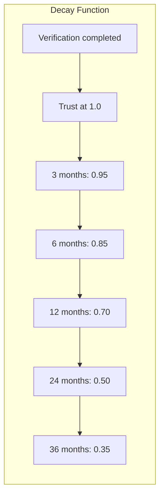
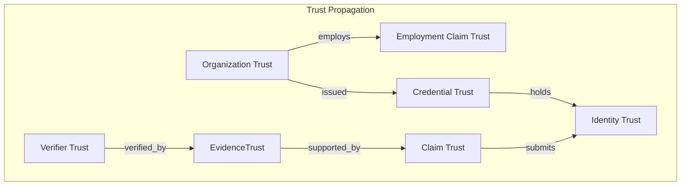

# Trust Model

## Purpose

This document defines the Trust Engine for the Patorbit platform. The Trust Engine is the system responsible for computing and managing Trust Scores across all entities in the platform: Claims, Evidence, Verifiers, and Organizations.

## Scope

This document covers trust sources, verification levels, trust score computation, decay rules, propagation, and algorithmic considerations.

---

## Trust Framework

Trust in the Patorbit platform is built on three pillars:

1. **Verification**: Formal validation of claims by trusted entities.
2. **Evidence Quality**: The type, source, and strength of supporting evidence.
3. **Reputation**: Historical accuracy and behavior of verifiers and organizations.

Trust is expressed as a **Trust Score**, a value between 0.0 and 1.0, computed for every entity in the system.

---

## Trust Sources

Trust scores are derived from the following sources:

| Source                   | Description                                       | Initial Weight |
| ------------------------ | ------------------------------------------------- | -------------- |
| **Verification Verdict** | Whether evidence passed or failed verification    | 0.40           |
| **Verifier Trust**       | Trust score of the entity performing verification | 0.25           |
| **Evidence Type Weight** | Inherent credibility of the evidence type         | 0.15           |
| **Source Authority**     | Authority level of the issuing entity             | 0.10           |
| **Recency**              | Age of the verification activity                  | 0.05           |
| **Corroboration**        | Number of independent verification sources        | 0.05           |

---

## Trust Score Computation

### Claim Trust Score

```
ClaimTrust = f( EvidenceTrusts, VerificationHistory )
```

Where:

- `EvidenceTrusts` is the list of trust scores for all evidence linked to this claim.
- `VerificationHistory` includes all verification outcomes for the evidence.

The algorithm:

1. Collect all evidence linked to the claim.
2. Compute trust score for each evidence node.
3. Aggregate evidence trust scores, weighted by evidence type trust weight.
4. Adjust based on verification history (multiple verifications strengthen trust).
5. Apply decay factor based on age of last verification.

### Evidence Trust Score

```
EvidenceTrust = f( VerificationOutcomes, VerifierTrust, EvidenceTypeWeight )
```

The algorithm:

1. Setup base weight from evidence type (document = 0.8, email verification = 0.9, etc.).
2. For each verification:
   - If verdict is `verified`, add `typeWeight * verifierTrust` to score.
   - If verdict is `rejected`, subtract `typeWeight * verifierTrust` from score.
   - If verdict is `indeterminate`, add 0.
3. Compute average across all verifications.
4. Apply decay: multiply by `decayFactor(monthsSinceLastVerification)`.

### Verifier Trust Score

```
VerifierTrust = f( HistoricalAccuracy, VerificationCount, Recency )
```

The algorithm:

1. Base score 0.5.
2. For each verification performed:
   - If later verifications confirm this verifier's verdict, increase score.
   - If later verifications contradict this verifier's verdict, decrease score.
3. Adjust by volume: more verifications provide more confidence in the score.
4. Apply recency: recent verifications carry more weight.

### Organization Trust Score

```
OrgTrust = f( VerificationLevel, IssuerHistory, MemberVerificationRate )
```

The algorithm:

1. Base score from verification level:
   - `unverified`: 0.3
   - `domain_verified`: 0.6
   - `legally_verified`: 0.8
2. Adjust by credential issuance history and challenge rate.
3. Adjust by member verification rate (how many employee claims they verify).
4. Apply penalties for revoked credentials or disputed verifications.

---

## Decay Rules

Trust scores decay over time without fresh verification activity.



| Time Since Last Verification | Decay Factor                            |
| ---------------------------- | --------------------------------------- |
| 0–3 months                   | 1.0 (no decay)                          |
| 3–6 months                   | 0.95                                    |
| 6–12 months                  | 0.85                                    |
| 12–24 months                 | 0.70                                    |
| 24–36 months                 | 0.50                                    |
| 36+ months                   | continues linear decay toward 0.1 floor |

The decay function:

```
decayFactor(t) = max(0.1, 1.0 - log2(1 + t/90))
```

Where `t` is the number of days since the last verification.

---

## Propagation Rules

Trust propagates through the Knowledge Graph along defined paths:



**Propagation Rules**:

1. **Upward Propagation**: Trust flows from lower-level entities to higher-level aggregates.
   - Evidence Trust → Claim Trust → Identity Trust (partial)
   - Verification Trust → Evidence Trust

2. **Authority Propagation**: Trust filters from authoritative sources.
   - Organization Trust → Employment Claim Trust (higher weight)
   - Verifier Trust → Verification Outcome (weighted)

3. **Bounded Impact**: Propagation is limited to one degree. An identity's trust does not fully propagate to all their claims; each claim maintains independent trust from its own evidence.

4. **Revocation Cascades**: If an Organization's trust drops significantly, all claims verified by that organization are flagged for re-verification, and credential trust is immediately reduced.

---

## Verification Levels

| Level                     | Required Conditions                          | Base Trust Impact |
| ------------------------- | -------------------------------------------- | ----------------- |
| **Unverified**            | No verification performed                    | 0.0               |
| **Self-asserted**         | Claim submitted by identity with no evidence | 0.1               |
| **AI verified**           | Automated verification by AI system          | 0.6               |
| **Document verified**     | Human review of supporting documentation     | 0.8               |
| **Organization verified** | Verification by a trusted organization       | 0.95              |
| **Multi-source verified** | Verified by two or more independent sources  | 0.99              |

---

## Edge Cases

- **Conflicting Verifications**: When multiple verifications produce different verdicts, the system weights by verifier trust and takes the weighted majority.
- **Stale Claims**: Claims with no verification activity for more than 24 months have trust scores floored to 0.2 until refreshed.
- **Identity Deletion**: If an identity is deactivated, their claims remain in the graph with trust scores preserved (frozen) but their claims are flagged as "inactive".
- **New Verifier**: A newly onboarded verifier starts with a base trust of 0.5 until they complete 10 verifications with confirmed accuracy.

## References

- [Confidence Model](confidence-model.md): How confidence scores combine trust with AI-derived signals.
- [Knowledge Graph](knowledge-graph.md): How trust propagates through graph edges.
- [Domain Services](domain-services.md): Trust Calculation Service.
- [Value Objects](value-objects.md): TrustScore value object.
