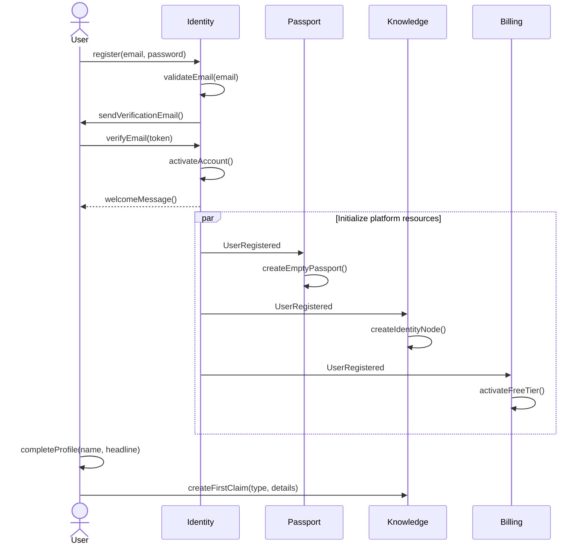
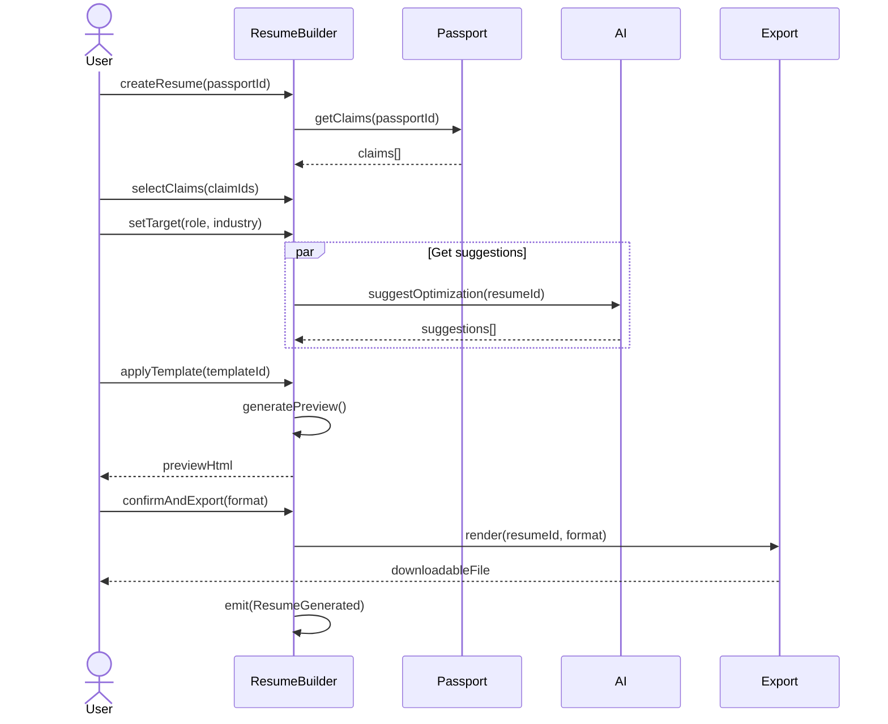
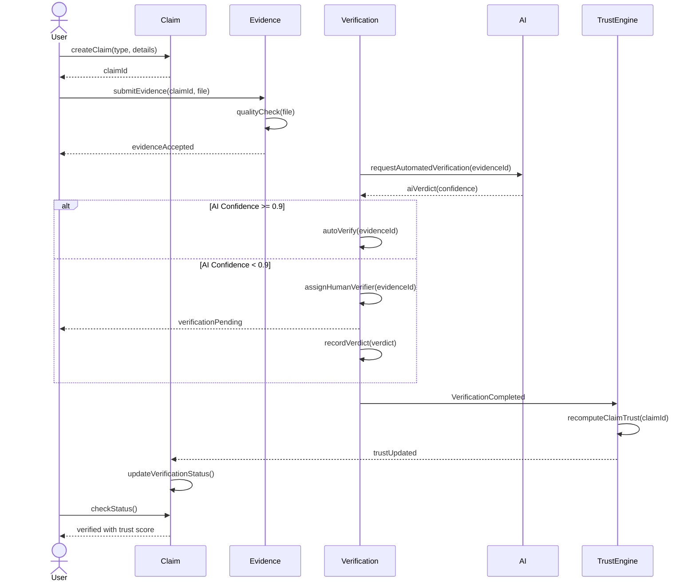
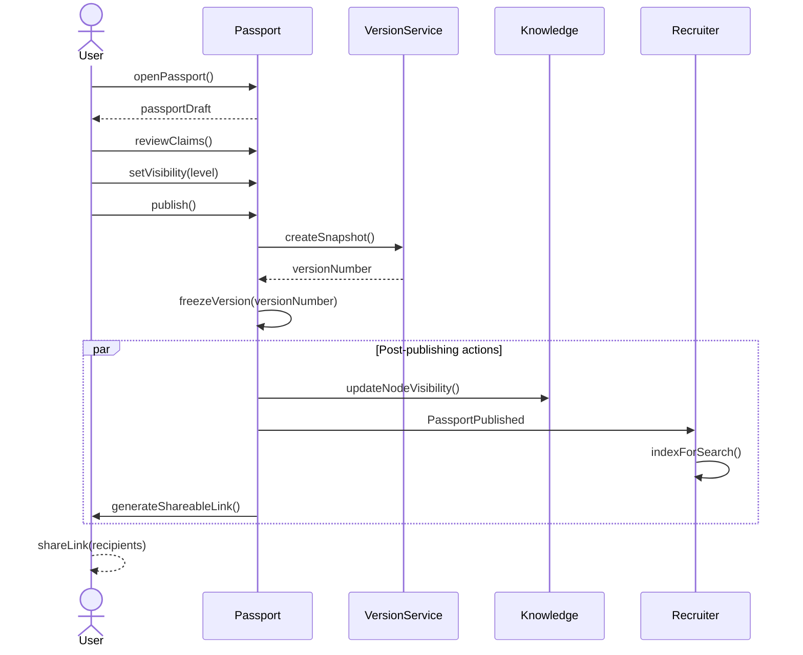
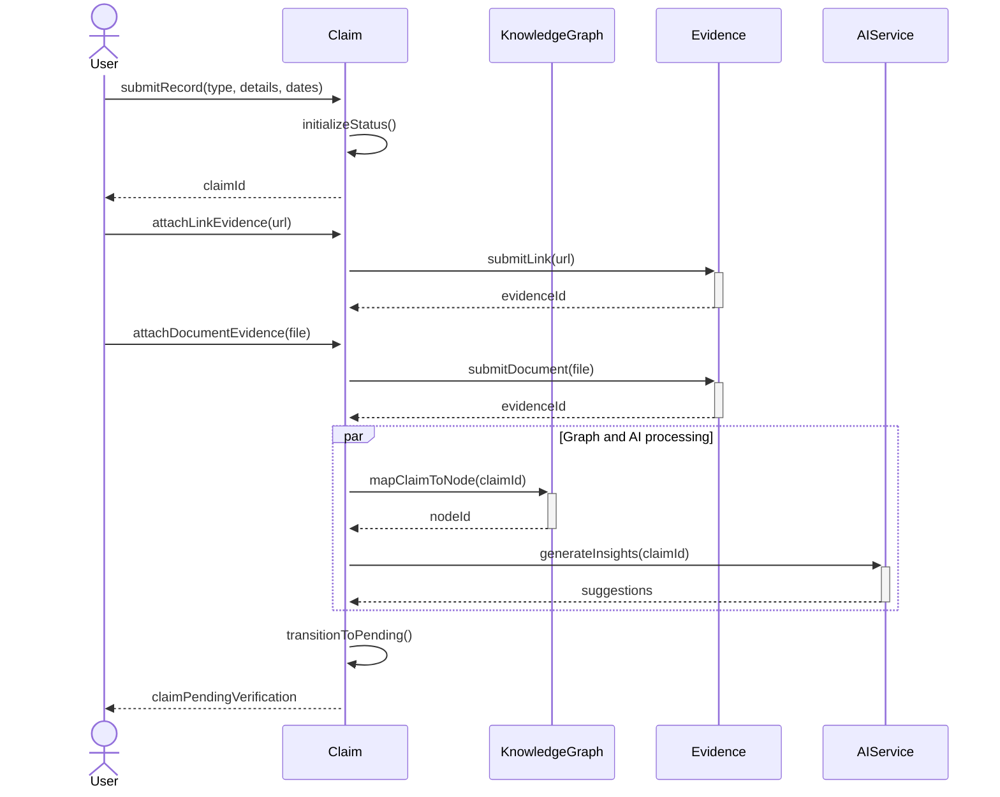
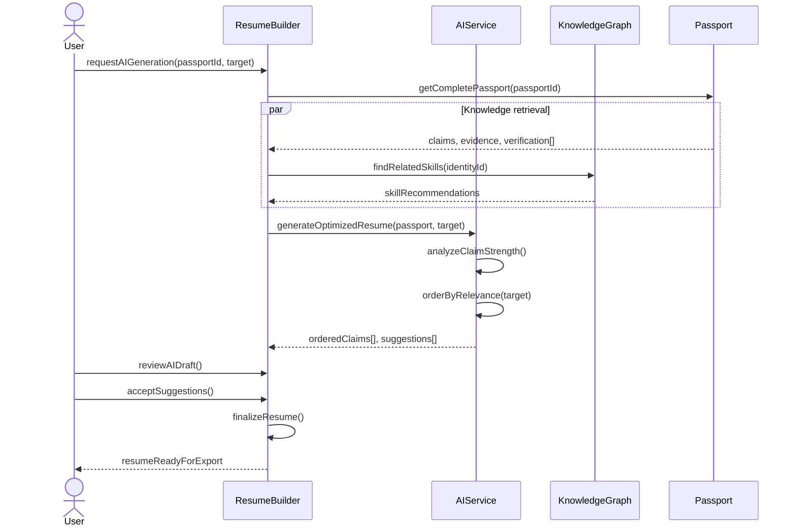
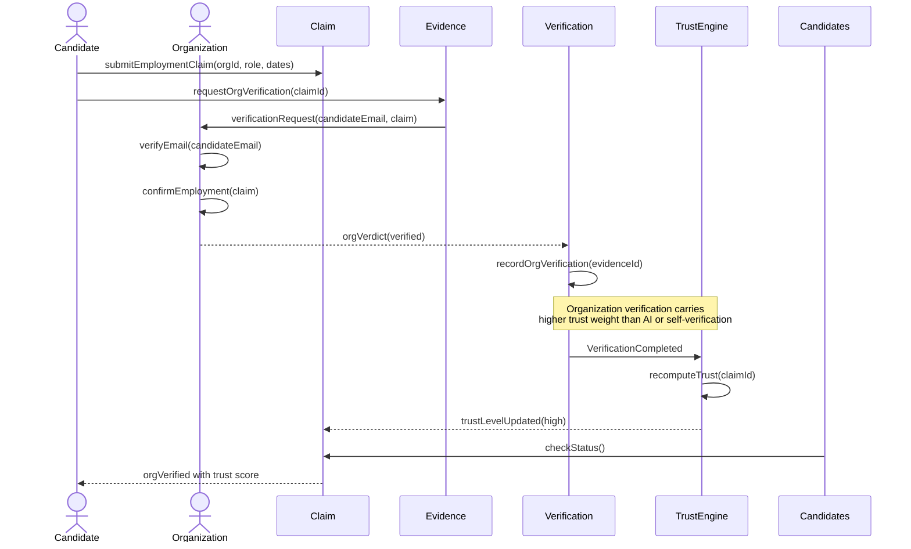
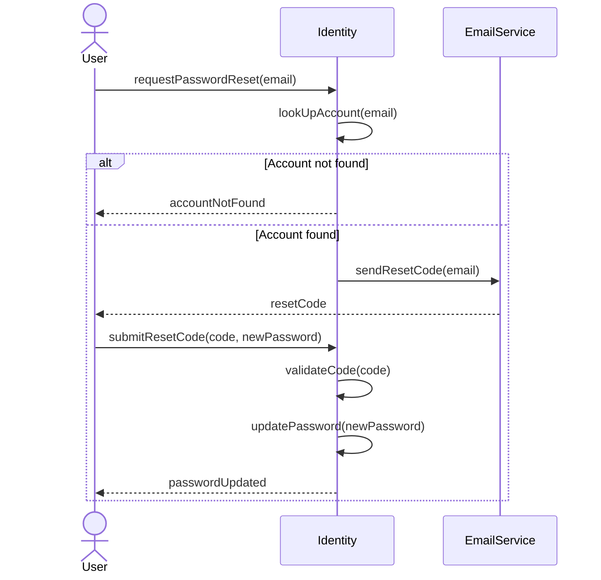

# Workflows

## Purpose

This document defines the primary business workflows within the Patorbit platform. Workflows represent end-to-end processes that span multiple bounded contexts and domain services.

## Scope

This document covers all major business workflows, including user onboarding, resume creation, claim verification, evidence submission, passport publishing, recruiter verification, and AI resume generation.

---

## 1. User Onboarding

**Description**: The complete user registration and initial setup process, from account creation to passport initialization.

**Actors**: User, System

**Preconditions**:

- The user has no existing Patorbit account.
- The user has a valid email address.

**Postconditions**:

- The user has an active account with a verified email.
- An empty Career Passport has been created.
- A free tier subscription has been activated.

---

## 2. Resume Creation

**Description**: Creating a targeted resume from an existing Career Passport, from claim selection through to export.

**Actors**: User, System

**Preconditions**:

- The user has an active Career Passport with at least one claim.
- The user has a verified identity.

**Postconditions**:

- A new resume version is created from the selected claims.
- The resume is available in the chosen format.

---

## 3. Claim Verification

**Description**: The end-to-end workflow for verifying a professional claim, from submission through evidence collection and verification.

**Actors**: User, AI Verifier, Human Verifier (optional), System

**Preconditions**:

- The user has an active account.
- A claim exists in the user's passport.

**Postconditions**:

- The claim's status is updated to `verified` or `rejected`.
- The Trust Score is recalculated.
- The Knowledge Graph is updated with verification results.

---

## 4. Passport Publishing

**Description**: Publishing a Career Passport, making selected claims visible and searchable by recruiters and organizations.

**Actors**: User, System

**Preconditions**:

- The user has a populated Career Passport with at least one claim.
- The user's email is verified.

**Postconditions**:

- An immutable version of the passport is created.
- The passport is discoverable based on visibility settings.
- A shareable link is generated.

---

## 5. Record Submission (with Evidence)

**Description**: The workflow for a user to add or update a professional record, including the linking of supporting evidence.

**Actors**: User, System

**Preconditions**:

- User has an active Career Passport.

**Postconditions**:

- A new claim is created with the provided details.
- The evidence has been submitted and queued for verification.

---

## 6. AI Resume Generation

**Description**: The AI-powered workflow for analyzing a passport and generating an optimized, tailored resume.

**Actors**: User, AI Service, System

**Preconditions**:

- User passport has at least one claim.

**Postconditions**:

- An AI-optimized resume is created with suggestions.

---

## 7. Recruiter Verification

**Description**: The process by which an organization verifies a claim on behalf of a current or past employee.

**Actors**: Candidate, Organization, Recruiter, System

**Preconditions**:

- The candidate has a claim referencing the organization.
- The organization has verified its domain.

**Postconditions**:

- The claim is verified with high trust weight (organization-level trust).

---

## 8. Account Recovery

**Description**: The workflow for a user to regain access to their account after losing credentials.

**Actors**: User, System

**Preconditions**:

- User has a registered email.

**Postconditions**:

- User's password is reset and access is restored.

---

## Workflow Summary

| Workflow                     | Context(s)                             | Key Events                                                   | Primitives                                           |
| ---------------------------- | -------------------------------------- | ------------------------------------------------------------ | ---------------------------------------------------- |
| User Onboarding              | Identity, Passport, Knowledge, Billing | `UserRegistered`, `IdentityVerified`                         | Registration form, email verification                |
| Resume Creation              | Resume Builder, Passport, AI           | `ResumeGenerated`                                            | Claim selection, target config, template application |
| Claim Verification           | Claim, Evidence, Verification, Trust   | `EvidenceSubmitted`, `VerificationCompleted`, `TrustUpdated` | Evidence submission, AI/human review                 |
| Passport Publishing          | Passport, Version, Recruiter           | `PassportPublished`                                          | Snapshot creation, visibility config                 |
| Record + Evidence Submission | Claim, Knowledge, Evidence, AI         | `ClaimCreated`, `EvidenceSubmitted`                          | Record form, file upload, URL linking                |
| AI Resume Generation         | Resume Builder, AI, Knowledge          | `InsightGenerated`                                           | AI analysis, optimization                            |
| Recruiter Verification       | Claim, Evidence, Org, Verification     | `VerificationCompleted`                                      | Org email verification                               |
| Account Recovery             | Identity                               | None                                                         | Email-based reset                                    |

## References

- [Domain Events](domain-events.md): Events published during these workflows.
- [Domain Services](domain-services.md): Services that orchestrate these workflows.
- [Bounded Contexts](bounded-contexts.md): Contexts involved in each workflow.
