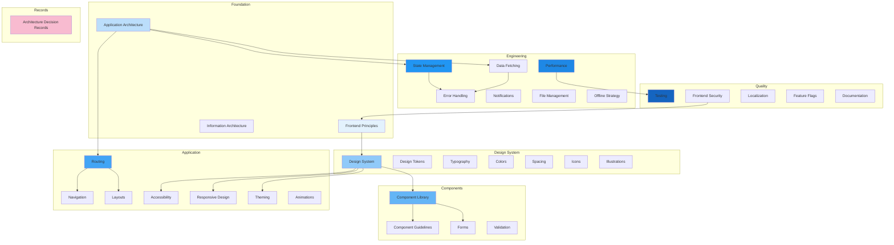

# Frontend Architecture

## Overview

This document set defines the complete frontend architecture and design system for the **Patorbit platform** — an AI-powered Career Intelligence Platform. It covers application architecture, design systems, component libraries, accessibility, performance, state management, and engineering practices for building scalable, maintainable frontends.

This is the canonical reference for all frontend design, development, and testing decisions.

## Navigation Guide

### For Frontend Engineers

Start with **Frontend Principles**, **Application Architecture**, and **Component Library**. Then deep-dive into **State Management**, **Data Fetching**, **Forms**, and **Performance**.

### For Designers

Start with **Design System**, **Design Tokens**, **Colors**, **Typography**, and **Spacing**. Then review **Component Library** and **Illustrations**.

### For QA / Testing Engineers

Focus on **Testing**, **Accessibility**, **Responsive Design**, and **Performance**.

## Document Map

## Document List

| #   | Document                                                          | Description                                        |
| --- | ----------------------------------------------------------------- | -------------------------------------------------- |
| 1   | [Frontend Principles](frontend-principles.md)                     | Core frontend engineering principles               |
| 2   | [Application Architecture](application-architecture.md)           | Shell, features, shared, state, and service layers |
| 3   | [Routing](routing.md)                                             | Public, protected, nested, and dynamic routing     |
| 4   | [Navigation](navigation.md)                                       | Global and contextual navigation patterns          |
| 5   | [Layouts](layouts.md)                                             | Layout patterns for all application areas          |
| 6   | [Information Architecture](information-architecture.md)           | Sitemap and user journeys                          |
| 7   | [Design System](design-system.md)                                 | Principles, component philosophy, governance       |
| 8   | [Design Tokens](design-tokens.md)                                 | Spacing, radius, elevation, motion, breakpoints    |
| 9   | [Typography](typography.md)                                       | Type scale, hierarchy, responsive type             |
| 10  | [Colors](colors.md)                                               | Semantic color system, dark mode, contrast         |
| 11  | [Spacing](spacing.md)                                             | Spacing scale and layout grid                      |
| 12  | [Icons](icons.md)                                                 | Icon usage guidelines                              |
| 13  | [Illustrations](illustrations.md)                                 | Illustration style and usage                       |
| 14  | [Component Library](component-library.md)                         | Complete component inventory                       |
| 15  | [Component Guidelines](component-guidelines.md)                   | Component lifecycle, composition, states           |
| 16  | [Forms](forms.md)                                                 | Form architecture, validation, wizards             |
| 17  | [Validation](validation.md)                                       | Frontend validation strategy                       |
| 18  | [Accessibility](accessibility.md)                                 | WCAG 2.2 AA compliance                             |
| 19  | [Responsive Design](responsive-design.md)                         | Breakpoints, mobile-first approach                 |
| 20  | [Theming](theming.md)                                             | Light and dark themes                              |
| 21  | [Animations](animations.md)                                       | Micro-interactions and motion system               |
| 22  | [State Management](state-management.md)                           | Server, client, session, UI state                  |
| 23  | [Data Fetching](data-fetching.md)                                 | API interaction, caching, optimistic updates       |
| 24  | [Error Handling](error-handling.md)                               | Error UX patterns                                  |
| 25  | [Notifications](notifications.md)                                 | Toast, inbox, alerts                               |
| 26  | [File Management](file-management.md)                             | Upload and download UX                             |
| 27  | [Offline Strategy](offline-strategy.md)                           | Offline considerations                             |
| 28  | [Performance](performance.md)                                     | Budgets, Core Web Vitals, optimization             |
| 29  | [Testing](testing.md)                                             | Unit, component, integration, E2E, visual          |
| 30  | [Frontend Security](frontend-security.md)                         | XSS, CSRF, CSP, secure storage                     |
| 31  | [Localization](localization.md)                                   | Internationalization strategy                      |
| 32  | [Feature Flags](feature-flags.md)                                 | Feature flag approach                              |
| 33  | [Documentation](documentation.md)                                 | Storybook, component docs, contributions           |
| 34  | [Architecture Decision Records](architecture-decision-records.md) | Major frontend decisions                           |

## References

- [System Architecture](../architecture/README.md): System integration.
- [API Architecture](../api/README.md): API consumption patterns.
- [Data Architecture](../data/README.md): Data models reflected in UI.
