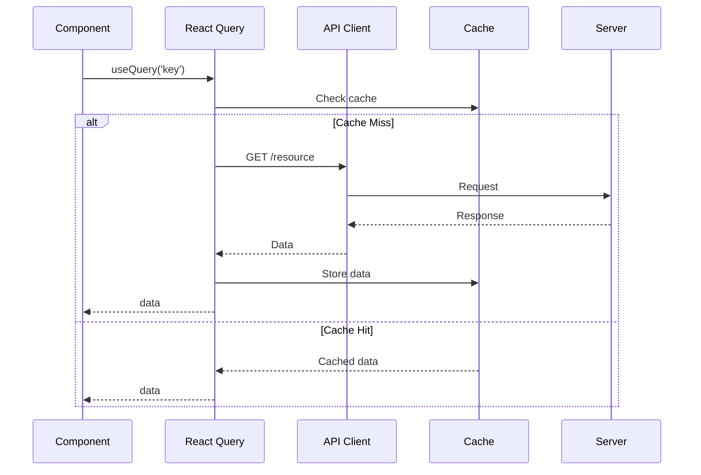

# Data Fetching

## Purpose

This document defines the API interaction strategy for the frontend, covering caching, optimistic updates, retries, and background refresh.

## Library

- **React Query** (TanStack Query) for all server state management.
- A thin **API client** (using `fetch`) for making HTTP requests.

## Data Fetching Flow

## Caching

- **Cache Keys**: Unique keys per query (e.g., `['claims', { passportId: '123' }]`).
- **Cache Invalidation**: On successful mutation (`POST`, `PUT`, `DELETE`), invalidate related query caches.
- **Stale-while-revalidate**: Serve stale data from cache while refetching in the background.

## Optimistic Updates

For high-confidence mutations (e.g., creating a claim), update the UI optimistically before the API responds. Roll back on failure.

## Retries

- Failed queries are retried 3 times with exponential backoff.
- Only retry on network errors or 5xx server errors.
- 4xx client errors are not retried.

## Background Refresh

- Data is automatically refetched on window refocus and network reconnection.
- Configure `staleTime` to control how long data is considered fresh.

## References

- [State Management](state-management.md): Server state.
- [Error Handling](error-handling.md): API errors.
- [Performance](performance.md): Caching for performance.
