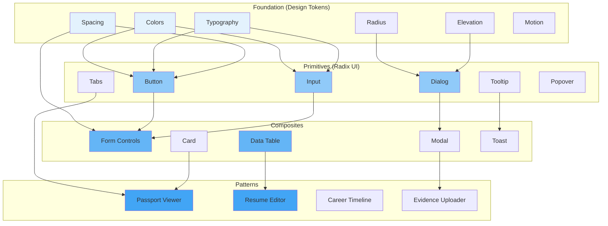

# Design System

## Purpose

This document defines the design system for the Patorbit platform, establishing a shared visual language that ensures consistency, scalability, and maintainability across all frontend applications.

## Scope

This document covers design system principles, component philosophy, naming conventions, composition, extensibility, and governance.

---

## Principles

1. **Atomic, but Flexible**: Components are built from small, reusable primitives (tokens) that can be composed into larger patterns.

2. **Accessibility First**: Every component meets WCAG 2.2 AA at minimum.

3. **Design Token-Driven**: All visual properties (colors, spacing, typography) are defined as tokens, not hardcoded values.

4. **Composition Over Configuration**: Components are designed to be composed, not configured with complex props.

5. **Progressive Disclosure**: Complex features are hidden behind simple defaults and exposed through composition.

6. **Themeable**: All tokens define light and dark mode values.

---

## Component Hierarchy

---

## Component Naming

| Pattern                    | Example                            |
| -------------------------- | ---------------------------------- |
| `{ComponentName}`          | `Button`, `Input`, `Dialog`        |
| `{ComponentName}{Variant}` | `ButtonPrimary`, `ButtonSecondary` |
| `{ComponentName}.{Part}`   | `Dialog.Header`, `Dialog.Body`     |

## Composition

- Components are composed using React's `children` prop or render props.
- Compound components allow for flexible layouts.
- Radix UI primitives are used for accessible, unstyled base components.

## Extensibility

- The design system is published as an npm package (`@patorbit/ui`).
- Components accept `className` and `style` props for ad-hoc overrides.
- The system is versioned independently of the application.

## Governance

- All new components require a design review and a documentation PR.
- Breaking changes to tokens or components require a major version bump.
- Component documentation is auto-generated from TypeScript types and JSDoc comments.

## References

- [Component Library](component-library.md): Complete component inventory.
- [Design Tokens](design-tokens.md): Token definitions.
- [Component Guidelines](component-guidelines.md): Component development standards.
