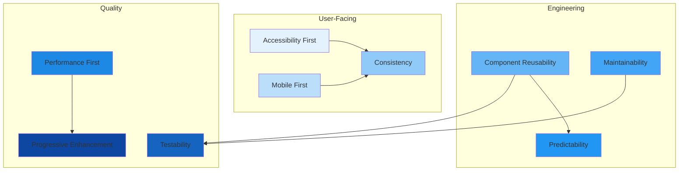

# Frontend Principles

## Purpose

This document defines the core principles that guide all frontend development at Patorbit. These principles ensure consistency, quality, and maintainability across the entire application.

## Scope

This document covers the engineering principles for all frontend applications.

---

## Principles

### 1. Accessibility First

**Principle**: All interfaces must be usable by everyone. Accessibility is a design requirement, not an afterthought.

**Rationale**: Career intelligence should be accessible to all users regardless of ability. Accessibility violations also create legal risk and degrade UX for all users.

**Application**:

- All components must meet WCAG 2.2 AA standards.
- Keyboard navigation must be fully supported.
- Screen reader announcements are required for dynamic content.
- Color contrast ratios must meet minimum requirements.

### 2. Mobile First

**Principle**: Design and develop for the smallest screen first, then progressively enhance for larger screens.

**Rationale**: Mobile-first design ensures a consistent experience across all devices and forces prioritization of core content. Mobile traffic accounts for a significant portion of users.

**Application**:

- All layouts are responsive by default.
- Touch targets meet minimum 44x44px size.
- Content hierarchy is preserved across breakpoints.

### 3. Progressive Enhancement

**Principle**: The core experience works without JavaScript. Enhanced features are layered on top.

**Rationale**: JavaScript failures should never break the fundamental experience. Progressive enhancement ensures resilience.

**Application**:

- Basic content and navigation is server-rendered.
- Interactive features are hydrated with JavaScript.
- Forms work with JavaScript disabled where possible.

### 4. Component Reusability

**Principle**: Build once, use everywhere. Every UI element should be a reusable component.

**Rationale**: Reusability speeds up development, ensures consistency, and reduces maintenance.

**Application**:

- All UI elements are components in the design system.
- Components are composable and configurable via props.
- Components are documented with examples and usage guidelines.
- Business logic is separated from presentation.

### 5. Consistency

**Principle**: Similar elements look and behave the same way throughout the application.

**Rationale**: Consistency reduces cognitive load, builds user trust, and simplifies maintenance.

**Application**:

- Design tokens define the visual language.
- Component library provides the building blocks.
- Patterns (forms, navigation, data display) follow conventions.
- Shared validation and error patterns.

### 6. Performance First

**Principle**: Performance is a feature. Every page, component, and interaction must be optimized.

**Rationale**: Performance directly impacts user satisfaction, engagement, and conversion. Every millisecond matters.

**Application**:

- Core Web Vitals are monitored and budgeted.
- Code splitting is used at route level and for heavy components.
- Images are optimized and lazy-loaded.
- Bundle size is tracked and reviewed.

### 7. Maintainability

**Principle**: Code is written for humans first. It must be readable, tested, and easy to modify.

**Rationale**: The frontend will evolve rapidly. Maintainable code reduces technical debt and onboarding time.

**Application**:

- Clear folder structure and naming conventions.
- Comprehensive test coverage.
- TypeScript for type safety.
- Documentation for complex logic and components.

### 8. Predictability

**Principle**: Components behave as expected. State changes are deterministic and traceable.

**Rationale**: Predictable code is easier to debug, test, and extend.

**Application**:

- Components are pure functions of their props and state.
- Side effects are isolated in hooks or services.
- State updates are immutable.
- Data flows in one direction.

### 9. Testability

**Principle**: Every piece of code must be testable. Testing is not optional.

**Rationale**: Confidence in code changes requires a comprehensive test suite.

**Application**:

- Business logic is extracted from UI for unit testing.
- Components are tested for interaction and rendering.
- Accessibility tests run automatically.
- Visual regression tests catch unintended style changes.

## Principle Hierarchy

## References

- [Application Architecture](application-architecture.md): Architecture applying these principles.
- [Accessibility](accessibility.md): Detailed accessibility implementation.
- [Performance](performance.md): Performance budget and optimization.
