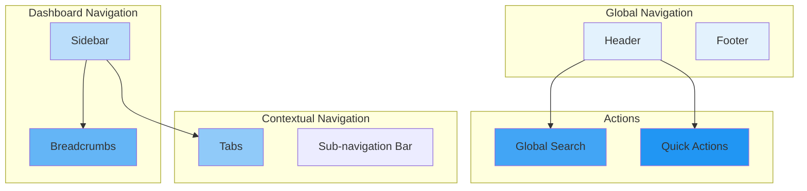

# Navigation

## Purpose

This document defines the global and contextual navigation architecture for the Patorbit platform, ensuring a consistent and intuitive user experience.

## Scope

This document covers headers, sidebars, footers, search, quick actions, and context navigation.

---

## Navigation Model

---

## Global Navigation

### Header

| State               | Elements                                                                  |
| ------------------- | ------------------------------------------------------------------------- |
| **Unauthenticated** | Logo, Features, Pricing, Login, Register                                  |
| **Authenticated**   | Logo, Global Search, Quick Actions, User Profile Menu, Workspace Switcher |

### Footer

- **Structure**: Multi-column layout with links to marketing pages, legal documents, social media, and contact information.

## Dashboard Navigation

### Sidebar

- **Structure**: Collapsible sidebar with icons and labels.
- **Sections**:
  - **Personal**: Dashboard, Career Passport, Resumes, Settings
  - **Recruiter**: Search, Candidates, Pipelines
  - **Organization**: Dashboard, Members, Verification, Settings
  - **Admin**: Users, Organizations, Analytics

## Contextual Navigation

### Tabs

- **Use Case**: Switching between different views of the same resource (e.g., Passport Edit, Passport Preview, Passport History).

### Sub-navigation Bar

- **Use Case**: Secondary navigation within a feature module (e.g., Settings > Profile, Settings > Account, Settings > Billing).

## Search and Quick Actions

### Global Search

- **Trigger**: Command palette (`Cmd+K`).
- **Functionality**: Search for pages, users, organizations, claims, and actions.

### Quick Actions

- **Trigger**: "Create New" button in the header.
- **Actions**:
  - New Claim
  - New Resume
  - Invite Member
  - Start Search

## Navigation Consistency

- Navigation elements are part of the shared component library.
- The active route is always highlighted in all navigation elements.
- The `useNavigation` hook provides access to the current route and navigation state.

## References

- [Routing](routing.md): Route definitions for navigation.
- [Layouts](layouts.md): How navigation fits into layouts.
- [Information Architecture](information-architecture.md): User journeys and site map.
