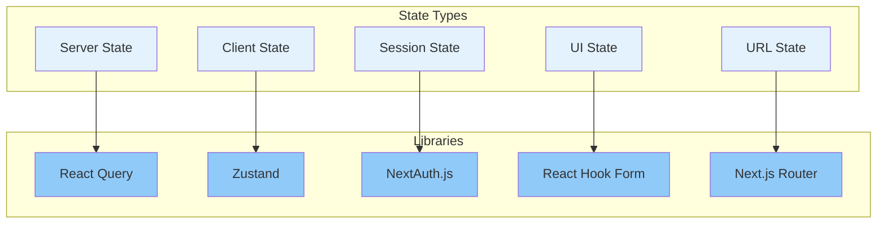

# State Management

## Purpose

This document defines the frontend state management architecture, ensuring predictable, maintainable, and performant state handling.

## Scope

This document covers server state, client state, session state, and UI state.

---

## State Architecture

---

## Server State

- **Library**: TanStack Query (React Query)
- **Purpose**: Manage data from the API (caching, refetching, invalidation).
- **Rules**: All data fetched from the API must be managed by React Query.

## Client State

- **Library**: Zustand
- **Purpose**: Manage global client state (theme, user preferences, sidebar state).
- **Rules**: Use for shared state that is not persisted on the server.

## Session State

- **Library**: NextAuth.js
- **Purpose**: Manage user session, authentication status, and roles.
- **Rules**: Access session via `useSession()` hook.

## UI State

- **Library**: React Hook Form, `useState`
- **Purpose**: Manage local component state (form inputs, modals, toggles).
- **Rules**: UI state should be co-located with the component that uses it.

## URL State

- **Library**: Next.js Router
- **Purpose**: Manage state that needs to be shareable (filters, search queries, pagination).
- **Rules**: Update URL via `useRouter` hook.

## References

- [Data Fetching](data-fetching.md): Server state interaction.
- [Application Architecture](application-architecture.md): State layer.
