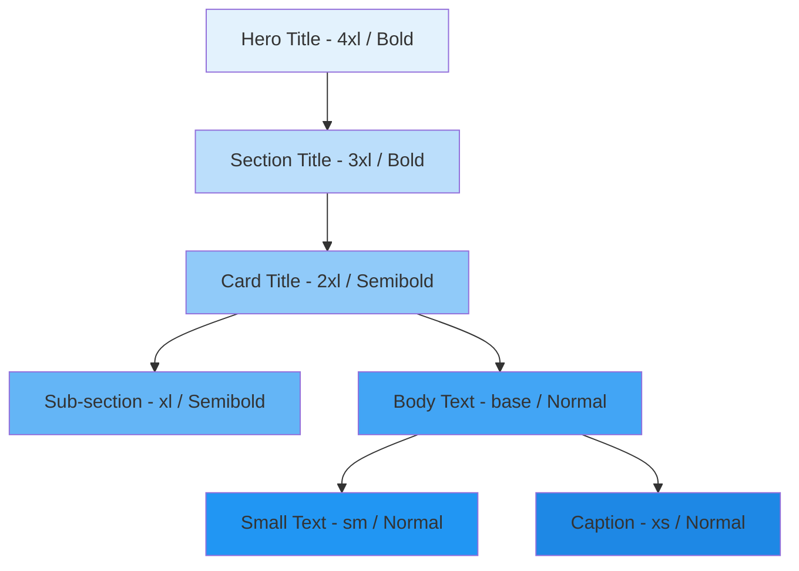

# Typography

## Purpose

This document defines the typography system for the Patorbit platform, ensuring readable, accessible, and consistent text across all interfaces.

## Scope

This document covers font selection, type scale, hierarchy, and responsive typography.

---

## Font Selection

**Primary Font**: Inter (self-hosted, subsetted)
**Monospace Font**: JetBrains Mono (for code and data)

## Type Scale

| Token         | Size | Line Height | Weight | Usage              |
| ------------- | ---- | ----------- | ------ | ------------------ |
| `--text-xs`   | 12px | 16px        | 400    | Captions, metadata |
| `--text-sm`   | 14px | 20px        | 400    | Body small, labels |
| `--text-base` | 16px | 24px        | 400    | Body text          |
| `--text-lg`   | 18px | 28px        | 500    | Large body, lead   |
| `--text-xl`   | 20px | 28px        | 600    | Sub-headings       |
| `--text-2xl`  | 24px | 32px        | 700    | Section headings   |
| `--text-3xl`  | 30px | 36px        | 700    | Page headings      |
| `--text-4xl`  | 36px | 44px        | 800    | Hero headings      |

## Font Weights

| Token             | Weight | Usage           |
| ----------------- | ------ | --------------- |
| `--font-normal`   | 400    | Body text       |
| `--font-medium`   | 500    | Emphasized body |
| `--font-semibold` | 600    | Sub-headings    |
| `--font-bold`     | 700    | Headings        |

## Text Hierarchy

## Responsive Typography

- **Desktop**: Full type scale.
- **Tablet**: Slightly reduced scale (e.g., `--text-4xl` becomes `--text-3xl`).
- **Mobile**: Compact scale (e.g., `--text-4xl` becomes `--text-2xl`).

## Accessibility

- **Minimum Size**: No text smaller than 12px.
- **Line Length**: Body text containers should be limited to 66 characters per line.
- **Contrast**: All text meets WCAG AA contrast requirements.

## References

- [Design System](design-system.md): Typography in context.
- [Colors](colors.md): Text colors.
- [Accessibility](accessibility.md): Readability requirements.
