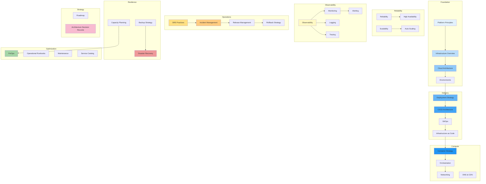

# Platform Operations Architecture

## Overview

This document set defines the complete DevOps, Infrastructure, Operations, and Reliability architecture for the **Patorbit platform** — an AI-powered Career Intelligence Platform. It covers cloud architecture, CI/CD, GitOps, observability, SRE practices, incident management, capacity planning, and cost optimization.

This is the canonical reference for all platform operations, SRE, and infrastructure engineering decisions.

## Navigation Guide

### For DevOps / Platform Engineers

Start with **Platform Principles**, **Infrastructure Overview**, **Cloud Architecture**, then deep-dive into **CI/CD Architecture**, **GitOps**, **Infrastructure as Code**, and **Container Strategy**.

### For SRE / Reliability Engineers

Focus on **SRE Practices**, **Reliability**, **High Availability**, **Scalability**, **Auto-Scaling**, **Observability**, **Monitoring**, **Alerting**, and **Incident Management**.

### For FinOps / Cost Engineers

Start with **FinOps**, **Capacity Planning**, and **Cost Optimization** across all operational documents.

## Document Map

## Document List

| #   | Document                                                          | Description                                  |
| --- | ----------------------------------------------------------------- | -------------------------------------------- |
| 1   | [Platform Principles](platform-principles.md)                     | Core operational principles                  |
| 2   | [Infrastructure Overview](infrastructure-overview.md)             | End-to-end infrastructure architecture       |
| 3   | [Cloud Architecture](cloud-architecture.md)                       | Cloud-provider-agnostic architecture         |
| 4   | [Environments](environments.md)                                   | Environment strategy and management          |
| 5   | [Deployment Strategy](deployment-strategy.md)                     | Blue/green, canary, rolling deployments      |
| 6   | [CI/CD Architecture](ci-cd-architecture.md)                       | Continuous integration and delivery          |
| 7   | [GitOps](gitops.md)                                               | GitOps workflow and repository strategy      |
| 8   | [Infrastructure as Code](infrastructure-as-code.md)               | IaC principles and state management          |
| 9   | [Container Strategy](container-strategy.md)                       | Container lifecycle and optimization         |
| 10  | [Orchestration](orchestration.md)                                 | Kubernetes-based orchestration               |
| 11  | [Networking](networking.md)                                       | VPC, subnets, ingress, service discovery     |
| 12  | [DNS & CDN](dns-cdn.md)                                           | DNS, CDN, edge, certificate management       |
| 13  | [Scalability](scalability.md)                                     | Horizontal and vertical scaling              |
| 14  | [Auto-Scaling](auto-scaling.md)                                   | Auto-scaling policies and triggers           |
| 15  | [Reliability](reliability.md)                                     | Circuit breakers, retries, bulkheads         |
| 16  | [High Availability](high-availability.md)                         | Multi-zone and multi-region HA               |
| 17  | [Observability](observability.md)                                 | Logs, metrics, traces strategy               |
| 18  | [Monitoring](monitoring.md)                                       | Infrastructure, app, database, AI monitoring |
| 19  | [Logging](logging.md)                                             | Structured logging and correlation           |
| 20  | [Tracing](tracing.md)                                             | Distributed tracing                          |
| 21  | [Alerting](alerting.md)                                           | Alert hierarchy and escalation               |
| 22  | [SRE Practices](sre-practices.md)                                 | SLIs, SLOs, error budgets                    |
| 23  | [Incident Management](incident-management.md)                     | Incident lifecycle and roles                 |
| 24  | [Release Management](release-management.md)                       | Release cadence and approvals                |
| 25  | [Rollback Strategy](rollback-strategy.md)                         | Application, database, AI rollback           |
| 26  | [Backup Strategy](backup-strategy.md)                             | Backup verification and retention            |
| 27  | [Disaster Recovery](disaster-recovery.md)                         | RPO, RTO, failover                           |
| 28  | [Capacity Planning](capacity-planning.md)                         | Growth forecasting and planning              |
| 29  | [FinOps](finops.md)                                               | Cloud cost governance                        |
| 30  | [Operational Runbooks](operational-runbooks.md)                   | Standard runbook templates                   |
| 31  | [Maintenance](maintenance.md)                                     | Patch management and lifecycle               |
| 32  | [Service Catalog](service-catalog.md)                             | Platform services inventory                  |
| 33  | [Roadmap](roadmap.md)                                             | Operations maturity roadmap                  |
| 34  | [Architecture Decision Records](architecture-decision-records.md) | Key operational decisions                    |

## References

- [System Architecture](../architecture/README.md): System design this operations model supports.
- [Security Architecture](../security/README.md): Security operations integration.
- [AI Architecture](../ai/README.md): AI-specific operational considerations.
