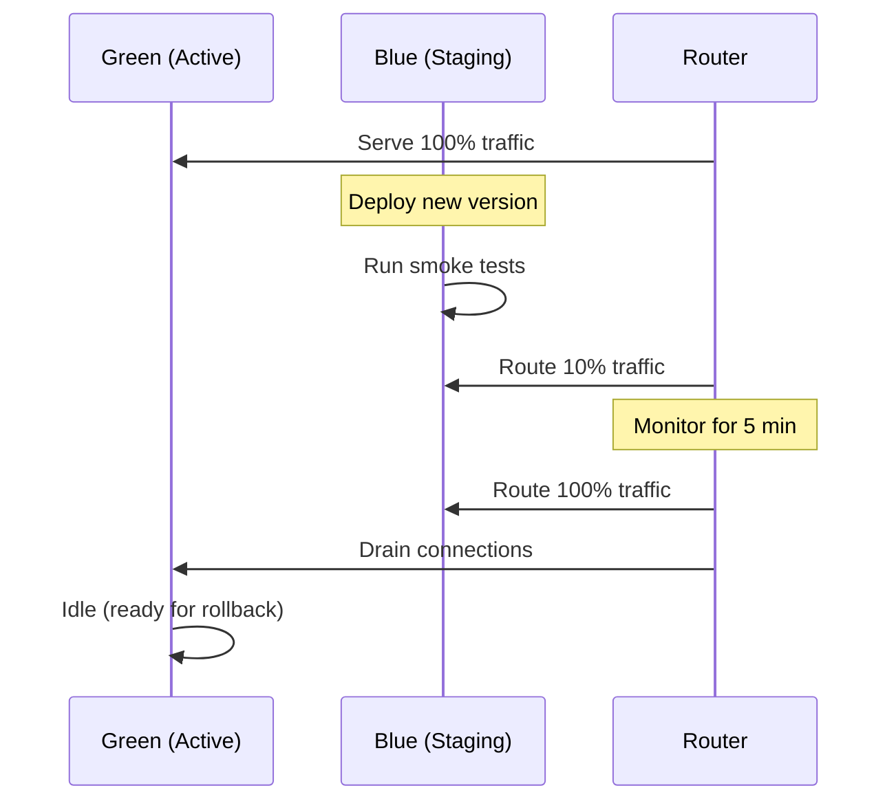

# Deployment Strategy

## Purpose

Deployment models for zero-downtime, risk-reduced releases.

## Deployment Models

| Model              | Use Case                            | Risk     |
| ------------------ | ----------------------------------- | -------- |
| **Rolling Update** | Standard deployments                | Low      |
| **Blue/Green**     | Major releases, database migrations | Low      |
| **Canary**         | Risky changes, AI model updates     | Very low |
| **Feature Flags**  | Feature-specific rollouts           | Minimal  |

## Blue/Green

## Canary Deployments

- Route 5-10% of traffic to new version.
- Monitor error rates and latency for 5-10 minutes.
- Gradually increase traffic if metrics are healthy.
- Rollback automatically if threshold exceeded.

## Database Migration Coordination

- Migrations are backward-compatible.
- Run migration before application deployment.
- Rollback migraion if application rollback is needed.

## References

- [CI/CD Architecture](ci-cd-architecture.md): CI/CD integration.
- [Rollback Strategy](rollback-strategy.md): Rollback procedures.
