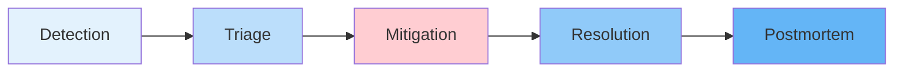

# Incident Management

## Purpose

Incident lifecycle, roles, and procedures.

## Incident Lifecycle

## Roles

| Role               | Responsibility              |
| ------------------ | --------------------------- |
| Incident Commander | Coordinates response        |
| Scribe             | Documents timeline          |
| Technical Lead     | Drives technical mitigation |
| Communicator       | Stakeholder updates         |

## Severity Definitions

| Severity | Definition                               | SLA               |
| -------- | ---------------------------------------- | ----------------- |
| SEV-1    | Platform unavailable, data loss          | 15 min response   |
| SEV-2    | Feature degraded, service partially down | 1 hour response   |
| SEV-3    | Minor issue, no user impact              | Next business day |
| SEV-4    | Cosmetic, informational                  | Next sprint       |

## Postmortem Process

- Timestamped timeline of events.
- Root cause analysis.
- Action items with owners and deadlines.
- Blame-free culture.

## References

- [Alerting](alerting.md): Alerting to incident.
- [SRE Practices](sre-practices.md): Error budgets.
