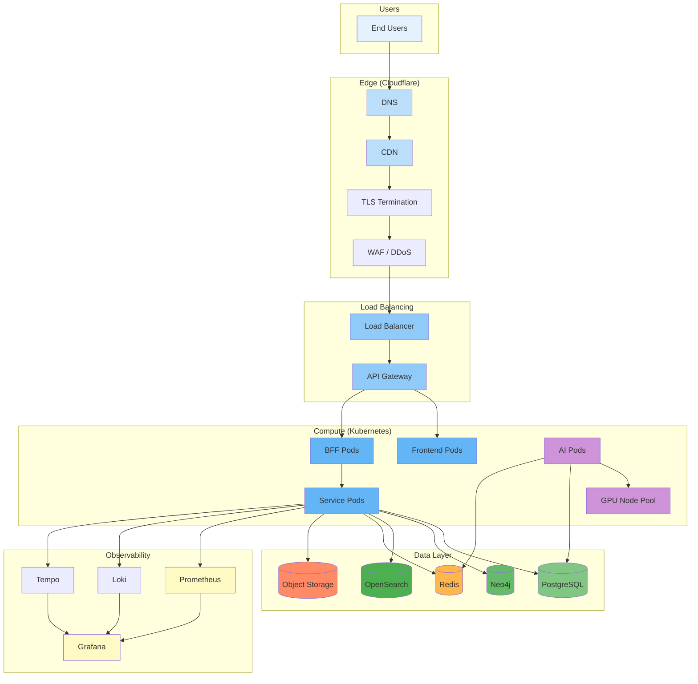

# Infrastructure Overview

## Purpose

This document describes the end-to-end infrastructure architecture for the Patorbit platform.

## Scope

This document covers all infrastructure components from the user edge to data storage.

---

## Infrastructure Architecture

---

## Component Responsibilities

### Edge Layer (Cloudflare)

| Component | Role                                      |
| --------- | ----------------------------------------- |
| DNS       | Global DNS resolution                     |
| CDN       | Static asset caching, edge delivery       |
| WAF       | Web application firewall, DDoS protection |
| SSL       | TLS 1.3 termination                       |

### Load Balancing

| Component     | Role                                     |
| ------------- | ---------------------------------------- |
| Load Balancer | Distributes traffic to compute instances |
| API Gateway   | Route, authenticate, rate limit          |

### Compute (Kubernetes)

| Component | Role                          |
| --------- | ----------------------------- |
| Frontend  | Next.js application (SSR)     |
| BFF       | Backend for Frontend services |
| Services  | Domain service pods           |
| AI        | AI inference pods             |

### Data Layer

| Component  | Role                 |
| ---------- | -------------------- |
| PostgreSQL | Operational database |
| Neo4j      | Knowledge Graph      |
| OpenSearch | Search and logging   |
| Redis      | Caching and queueing |
| S3         | Object storage       |

## References

- [Cloud Architecture](cloud-architecture.md): Cloud provider design.
- [Environments](environments.md): Environment architecture.
- [Networking](networking.md): Network design.
