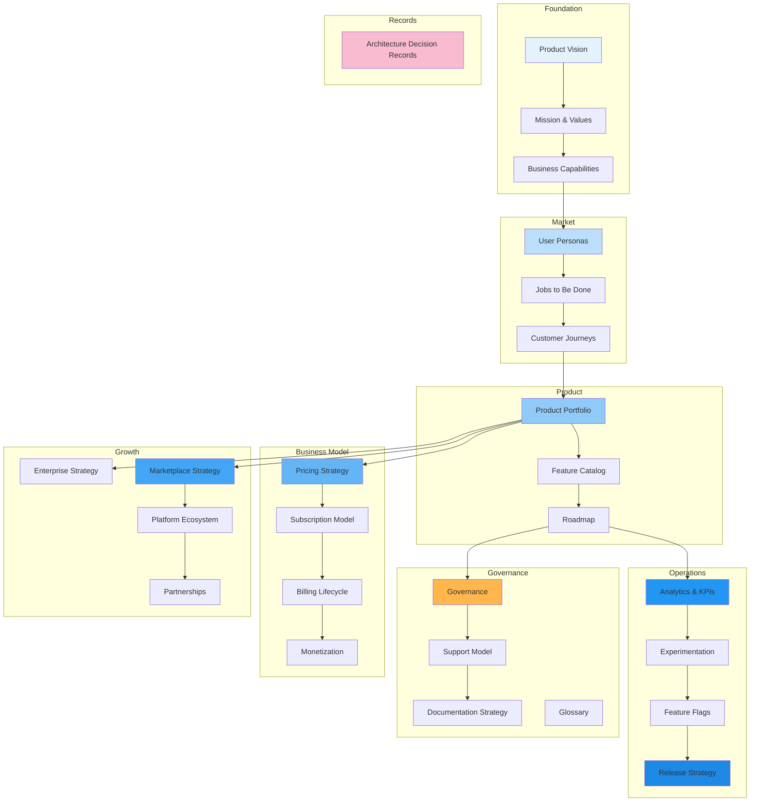

# Product & Business Architecture

## Overview

This document set defines the complete Product, Business, and Platform Strategy for the **Patorbit platform** — an AI-powered Career Intelligence Platform. It covers product vision, business capabilities, user personas, pricing, monetization, growth strategy, and enterprise readiness.

This is the canonical reference for all product strategy, business model, and platform ecosystem decisions.

## Document Map

## Document List

| #   | Document                                                          | Description                      |
| --- | ----------------------------------------------------------------- | -------------------------------- |
| 1   | [Product Vision](product-vision.md)                               | Long-term product vision         |
| 2   | [Mission & Values](mission-values.md)                             | Platform mission and core values |
| 3   | [Business Capabilities](business-capabilities.md)                 | Capability map                   |
| 4   | [User Personas](user-personas.md)                                 | Target customer segments         |
| 5   | [Jobs to Be Done](jobs-to-be-done.md)                             | Customer needs analysis          |
| 6   | [Customer Journeys](customer-journeys.md)                         | End-to-end user journeys         |
| 7   | [Product Portfolio](product-portfolio.md)                         | Current and future products      |
| 8   | [Feature Catalog](feature-catalog.md)                             | Feature tiers and organization   |
| 9   | [Roadmap](roadmap.md)                                             | Product roadmap                  |
| 10  | [Pricing Strategy](pricing-strategy.md)                           | Pricing model design             |
| 11  | [Subscription Model](subscription-model.md)                       | Plan structure and tiers         |
| 12  | [Billing Lifecycle](billing-lifecycle.md)                         | Subscription management          |
| 13  | [Monetization](monetization.md)                                   | Revenue streams                  |
| 14  | [Marketplace Strategy](marketplace-strategy.md)                   | Talent marketplace               |
| 15  | [Enterprise Strategy](enterprise-strategy.md)                     | Enterprise go-to-market          |
| 16  | [Platform Ecosystem](platform-ecosystem.md)                       | Ecosystem design                 |
| 17  | [Partnerships](partnerships.md)                                   | Partner model                    |
| 18  | [Analytics & KPIs](analytics-kpis.md)                             | Success metrics                  |
| 19  | [Experimentation](experimentation.md)                             | A/B testing framework            |
| 20  | [Feature Flags](feature-flags.md)                                 | Feature flag strategy            |
| 21  | [Release Strategy](release-strategy.md)                           | Release management               |
| 22  | [Governance](governance.md)                                       | Product governance               |
| 23  | [Support Model](support-model.md)                                 | Customer support                 |
| 24  | [Documentation Strategy](documentation-strategy.md)               | Product documentation            |
| 25  | [Glossary](glossary.md)                                           | Business glossary                |
| 26  | [Architecture Decision Records](architecture-decision-records.md) | Key product decisions            |

## References

- [Domain Architecture](../domain/README.md): Domain model the product implements.
- [System Architecture](../architecture/README.md): System capabilities.
- [API Architecture](../api/README.md): API products.
- [AI Architecture](../ai/README.md): AI-powered features.
