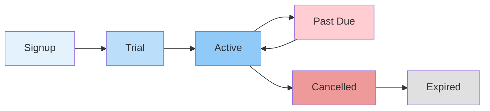

# Billing Lifecycle

## Purpose

Subscription management and billing process.

## Lifecycle Stages

## Billing Events

| Event         | Action                          |
| ------------- | ------------------------------- |
| Trial starts  | Free tier active                |
| Upgrade       | Charge prorated amount          |
| Renewal       | Charge full amount              |
| Payment fails | Retry 3 times, then downgrade   |
| Cancel        | Service active until period end |

## References

- [Subscription Model](subscription-model.md): Plans.
