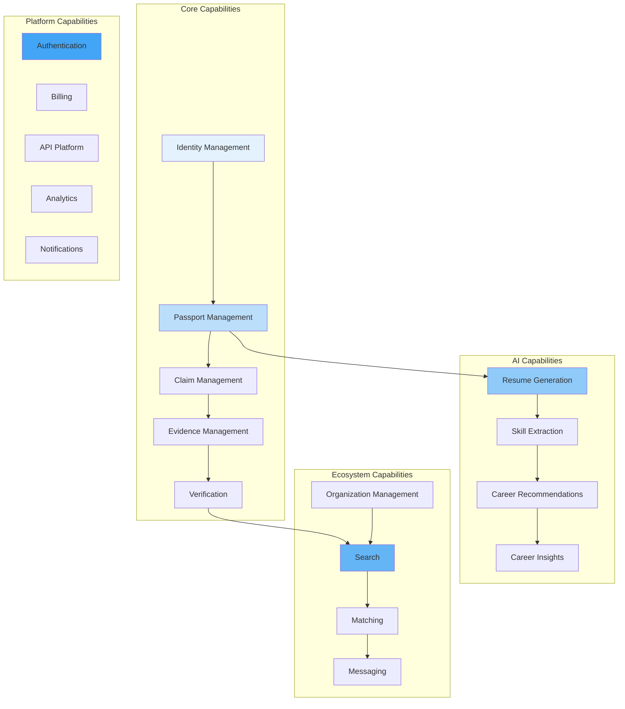

# Business Capabilities

## Purpose

Map of business capabilities the platform provides.

## Capability Map

## Capability Ownership

| Capability              | Product Area | Maturity |
| ----------------------- | ------------ | -------- |
| Identity Management     | Core         | MVP      |
| Passport Management     | Core         | MVP      |
| Verification            | Core         | MVP      |
| Resume Generation       | AI           | Growth   |
| Skill Extraction        | AI           | Growth   |
| Career Recommendations  | AI           | Future   |
| Candidate Search        | Recruiter    | Growth   |
| Organization Management | Enterprise   | Growth   |
| API Platform            | Platform     | Future   |

## References

- [Product Portfolio](product-portfolio.md): Product mapping.
