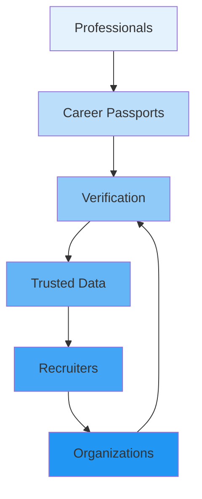

# Platform Ecosystem

## Purpose

Ecosystem design and platform participants.

## Participants

| Participant   | Role                         | Value                   |
| ------------- | ---------------------------- | ----------------------- |
| Professionals | Create and share career data | Career opportunities    |
| Recruiters    | Find and evaluate talent     | Verified candidate data |
| Organizations | Verify employees             | Talent intelligence     |
| Verifiers     | Verify evidence              | Verification fees       |
| Developers    | Build on the platform        | Access to career data   |
| Partners      | Integrate services           | Platform access         |

## Ecosystem Flywheel

## References

- [Partnerships](partnerships.md): Partner model.
