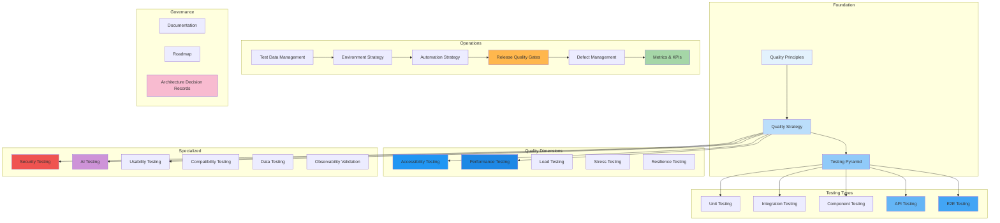

# Quality Engineering Architecture

## Overview

This document set defines the complete Quality Engineering and Testing architecture for the **Patorbit platform** — an AI-powered Career Intelligence Platform. It covers test strategies, automation, performance, accessibility, AI evaluation, and continuous quality across all layers.

This is the canonical reference for all quality engineering decisions, test automation, and release quality gates.

## Document Map

## Document List

| #   | Document                                                          | Description                             |
| --- | ----------------------------------------------------------------- | --------------------------------------- |
| 1   | [Quality Principles](quality-principles.md)                       | Core quality engineering principles     |
| 2   | [Quality Strategy](quality-strategy.md)                           | Overall quality approach and scope      |
| 3   | [Testing Pyramid](testing-pyramid.md)                             | Test distribution and portfolio         |
| 4   | [Unit Testing](unit-testing.md)                                   | Unit test standards and coverage        |
| 5   | [Integration Testing](integration-testing.md)                     | Integration testing patterns            |
| 6   | [Component Testing](component-testing.md)                         | Frontend component testing              |
| 7   | [API Testing](api-testing.md)                                     | API contract and functional testing     |
| 8   | [E2E Testing](e2e-testing.md)                                     | End-to-end user journey testing         |
| 9   | [Accessibility Testing](accessibility-testing.md)                 | WCAG 2.2 AA compliance testing          |
| 10  | [Performance Testing](performance-testing.md)                     | Performance budgets and optimization    |
| 11  | [Load Testing](load-testing.md)                                   | Load and scalability testing            |
| 12  | [Stress Testing](stress-testing.md)                               | System behavior under extreme load      |
| 13  | [Resilience Testing](resilience-testing.md)                       | Chaos engineering and fault tolerance   |
| 14  | [Security Testing](security-testing.md)                           | Security testing integration            |
| 15  | [AI Testing](ai-testing.md)                                       | AI evaluation and regression testing    |
| 16  | [Usability Testing](usability-testing.md)                         | User experience validation              |
| 17  | [Compatibility Testing](compatibility-testing.md)                 | Browser, device, platform compatibility |
| 18  | [Data Testing](data-testing.md)                                   | Data quality, migration, and integrity  |
| 19  | [Observability Validation](observability-validation.md)           | Validating monitoring and logging       |
| 20  | [Test Data Management](test-data-management.md)                   | Test data generation and management     |
| 21  | [Environment Strategy](environment-strategy.md)                   | Test environment management             |
| 22  | [Automation Strategy](automation-strategy.md)                     | Test automation approach                |
| 23  | [Release Quality Gates](release-quality-gates.md)                 | Mandatory pre-release checks            |
| 24  | [Defect Management](defect-management.md)                         | Defect lifecycle and tracking           |
| 25  | [Metrics & KPIs](metrics-kpis.md)                                 | Quality measurement framework           |
| 26  | [Documentation](documentation.md)                                 | Test documentation standards            |
| 27  | [Roadmap](roadmap.md)                                             | Quality maturity roadmap                |
| 28  | [Architecture Decision Records](architecture-decision-records.md) | Key quality decisions                   |

## References

- [System Architecture](../architecture/README.md): System under test.
- [API Architecture](../api/README.md): API testing context.
- [AI Architecture](../ai/README.md): AI evaluation context.
- [Operations Architecture](../operations/README.md): Testing infrastructure.
