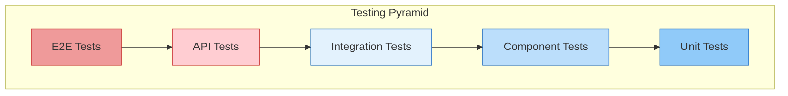

# Testing Pyramid

## Purpose

This document defines the test distribution strategy for the Patorbit platform, following the testing pyramid model.

## Scope

This document covers the test portfolio from unit tests to end-to-end tests.

---

## Testing Pyramid

| Layer       | Coverage | Speed  | Cost   |
| ----------- | -------- | ------ | ------ |
| Unit        | 70%      | Fast   | Low    |
| Component   | 15%      | Fast   | Low    |
| Integration | 10%      | Medium | Medium |
| API         | 5%       | Medium | Medium |
| E2E         | <5%      | Slow   | High   |

---

## Unit Tests

- **Focus**: Test individual functions, classes, and components in isolation.
- **Coverage Target**: 80% line coverage for critical business logic.
- **Tool**: Vitest / Jest.

## Component Tests

- **Focus**: Test UI components in isolation.
- **Coverage Target**: All components, all variants, all states.
- **Tool**: React Testing Library.

## Integration Tests

- **Focus**: Test interactions between modules and services.
- **Coverage Target**: Critical integration points.
- **Tool**: Vitest / Jest with mocked external services.

## API Tests

- **Focus**: Test API contracts and business logic at the API layer.
- **Coverage Target**: All public API endpoints.
- **Tool**: Postman / Newman.

## End-to-End (E2E) Tests

- **Focus**: Test critical user journeys from the browser.
- **Coverage Target**: P0 user flows (registration, passport creation, etc.).
- **Tool**: Playwright.

## Manual Testing

- **Focus**: Exploratory testing, usability testing, and areas not covered by automation.
- **Cadence**: Before each minor and major release.

## References

- [Unit Testing](unit-testing.md)
- [Component Testing](component-testing.md)
- [Integration Testing](integration-testing.md)
- [API Testing](api-testing.md)
- [E2E Testing](e2e-testing.md)
