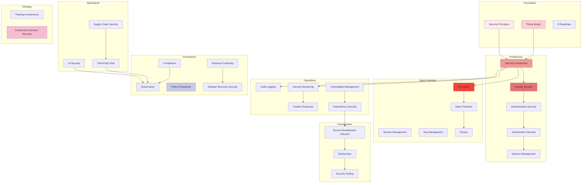

# Security & Governance Architecture

## Overview

This document set defines the complete Security, Privacy, Compliance, and Governance architecture for the **Patorbit platform** — an AI-powered Career Intelligence Platform handling highly sensitive personal and professional information.

This is the canonical reference for all security engineering, governance, risk management, and compliance decisions.

## Navigation Guide

### For Security Engineers

Start with **Security Principles**, **Threat Model**, **Security Architecture**, then deep-dive into **Identity Security**, **Authentication Security**, **Encryption**, and **Secrets Management**.

### For Developers

Focus on **Secure Development Lifecycle**, **DevSecOps**, **Dependency Security**, and **AI Security** for implementation guidance.

### For Governance / Compliance

Focus on **Governance**, **Policy Framework**, **Compliance**, **Privacy**, and **Risk Management**. Review **Audit Logging** and **Incident Response**.

### For Leadership

Review **Roadmap**, **Business Continuity**, **Third-Party Risk**, and **Risk Management** for strategic oversight.

## Document Map

## Document List

| #   | Document                                                          | Description                             |
| --- | ----------------------------------------------------------------- | --------------------------------------- |
| 1   | [Security Principles](security-principles.md)                     | Core security and governance principles |
| 2   | [Threat Model](threat-model.md)                                   | STRIDE-based threat model               |
| 3   | [Risk Management](risk-management.md)                             | Risk assessment framework               |
| 4   | [Security Architecture](security-architecture.md)                 | End-to-end security design              |
| 5   | [Identity Security](identity-security.md)                         | Identity lifecycle protection           |
| 6   | [Authentication Security](authentication-security.md)             | Secure authentication mechanisms        |
| 7   | [Authorization Security](authorization-security.md)               | Access control and policy enforcement   |
| 8   | [Session Management](session-management.md)                       | Session lifecycle and protection        |
| 9   | [Secrets Management](secrets-management.md)                       | Secret storage and rotation             |
| 10  | [Key Management](key-management.md)                               | Encryption key lifecycle                |
| 11  | [Encryption](encryption.md)                                       | Data encryption strategy                |
| 12  | [Data Protection](data-protection.md)                             | PII and sensitive data safeguards       |
| 13  | [Privacy](privacy.md)                                             | Privacy by Design implementation        |
| 14  | [Compliance](compliance.md)                                       | Regulatory compliance readiness         |
| 15  | [Audit Logging](audit-logging.md)                                 | Immutable audit trails                  |
| 16  | [Security Monitoring](security-monitoring.md)                     | Detection and alerting                  |
| 17  | [Incident Response](incident-response.md)                         | Incident management lifecycle           |
| 18  | [Vulnerability Management](vulnerability-management.md)           | Scanning and remediation                |
| 19  | [Dependency Security](dependency-security.md)                     | Supply chain for dependencies           |
| 20  | [Secure Development Lifecycle](secure-development-lifecycle.md)   | SSDLC framework                         |
| 21  | [DevSecOps](devsecops.md)                                         | CI/CD security integration              |
| 22  | [AI Security](ai-security.md)                                     | AI-specific security threats            |
| 23  | [Supply Chain Security](supply-chain-security.md)                 | Third-party supply chain                |
| 24  | [Third-Party Risk](third-party-risk.md)                           | Vendor risk management                  |
| 25  | [Governance](governance.md)                                       | Security governance structure           |
| 26  | [Policy Framework](policy-framework.md)                           | Security policy catalog                 |
| 27  | [Business Continuity](business-continuity.md)                     | Operational resilience                  |
| 28  | [Disaster Recovery Security](disaster-recovery-security.md)       | DR security controls                    |
| 29  | [Security Testing](security-testing.md)                           | Penetration testing and red team        |
| 30  | [Training & Awareness](training-awareness.md)                     | Security culture program                |
| 31  | [Roadmap](roadmap.md)                                             | Security maturity roadmap               |
| 32  | [Architecture Decision Records](architecture-decision-records.md) | Key security decisions                  |

## References

- [Domain Architecture](../domain/README.md): Domain model and permissions.
- [System Architecture](../architecture/README.md): System-level security integration.
- [Data Architecture](../data/README.md): Data protection foundation.
- [API Architecture](../api/README.md): API security controls.
- [AI Architecture](../ai/README.md): AI security context.
