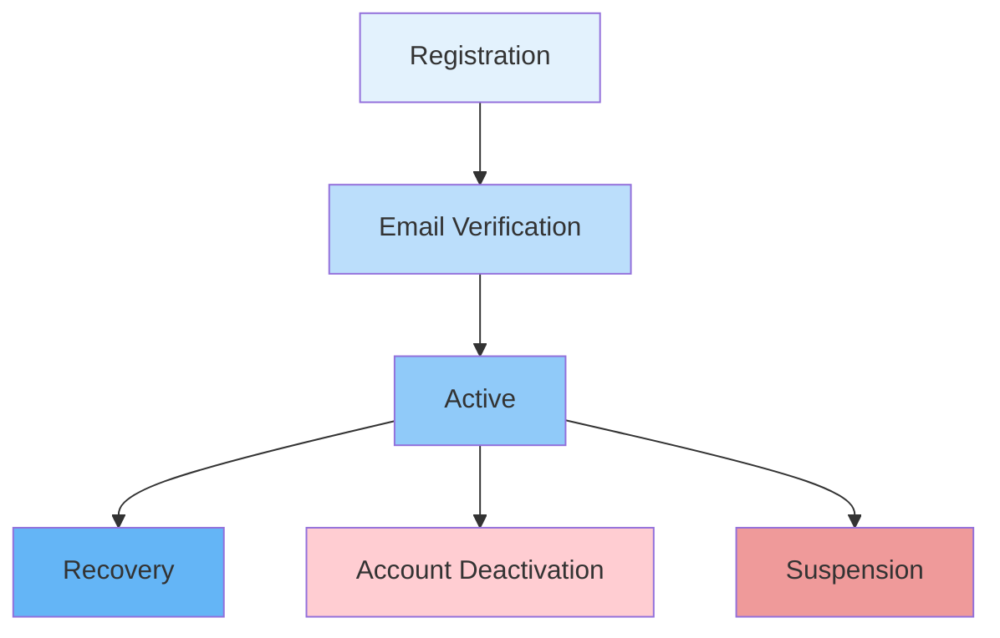

# Identity Security

## Purpose

This document defines the security architecture for managing and protecting user identities throughout their lifecycle.

## Scope

This document covers secure registration, identity verification, account recovery, and account protection.

---

## Identity Lifecycle

---

## Secure Registration

| Control               | Description                                 |
| --------------------- | ------------------------------------------- |
| **Unique Email**      | Enforce unique, verified email per account. |
| **Password Strength** | Enforce strong password policy.             |
| **Rate Limiting**     | Limit registration attempts per IP.         |
| **CAPTCHA**           | Protect against bot registration.           |

## Identity Verification

| Level   | Method                              |
| ------- | ----------------------------------- |
| Level 1 | Email verification (one-time code). |
| Level 2 | Phone verification (SMS OTP).       |
| Level 3 | Government ID verification (KYC).   |

## Account Recovery

- **Password Reset**: Secure email-based flow with expiring tokens.
- **MFA Recovery**: Backup codes (pre-generated).
- **Support-based Recovery**: Manual identity verification by support team.

## Account Protection

| Control                         | Description                                           |
| ------------------------------- | ----------------------------------------------------- |
| **MFA**                         | TOTP, passkeys, SMS OTP.                              |
| **Device Trust**                | Fingerprint devices, require re-auth on new devices.  |
| **Breached Password Detection** | Check passwords against known breach databases.       |
| **Anomaly Detection**           | Detect suspicious login patterns (impossible travel). |

## References

- [Authentication Security](authentication-security.md): Authentication methods.
- [Session Management](session-management.md): Session security.
- [Privacy](privacy.md): PII protection.
