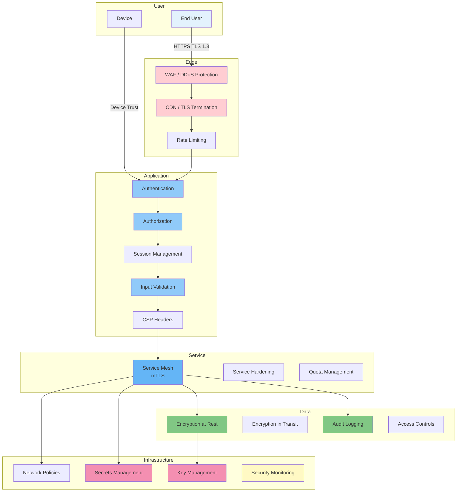

# Security Architecture

## Purpose

This document defines the end-to-end security architecture of the Patorbit platform, showing how security controls are applied at every layer.

## Scope

This document covers all security layers from user to data.

---

## Security Architecture Overview

---

## Layer Controls

### 1. Edge Layer

| Control         | Implementation                                  |
| --------------- | ----------------------------------------------- |
| WAF             | Cloudflare WAF blocking SQLi, XSS, OWASP top 10 |
| DDoS Protection | Cloudflare DDoS mitigation                      |
| TLS Termination | TLS 1.3 minimum, HSTS                           |
| Rate Limiting   | Per user/IP/API key                             |

### 2. Application Layer

| Control            | Implementation                       |
| ------------------ | ------------------------------------ |
| Authentication     | OAuth 2.1, JWT, MFA                  |
| Authorization      | RBAC + ABAC via policy engine        |
| Session Management | HTTP-only cookies, short TTL         |
| Input Validation   | Zod schemas, class-validator         |
| CSRF Protection    | SameSite cookies, CSRF tokens        |
| CSP                | Strict Content Security Policy       |
| XSS Protection     | React auto-escaping, output encoding |

### 3. Service Layer

| Control           | Implementation                      |
| ----------------- | ----------------------------------- |
| mTLS              | Istio/Linkerd service mesh          |
| Service Hardening | Minimal base images, non-root users |
| Quota Management  | Resource limits per service         |

### 4. Data Layer

| Control               | Implementation               |
| --------------------- | ---------------------------- |
| Encryption at Rest    | AES-256, envelope encryption |
| Encryption in Transit | TLS 1.3 for all connections  |
| Access Controls       | Row-level security, IAM      |
| Audit Logging         | Immutable audit trail        |
| Data Retention        | Automated lifecycle policies |

### 5. Infrastructure Layer

| Control             | Implementation                               |
| ------------------- | -------------------------------------------- |
| Network Policies    | Kubernetes network policies, security groups |
| Secrets Management  | HashiCorp Vault / AWS Secrets Manager        |
| Key Management      | AWS KMS / Cloud KMS with rotation            |
| Security Monitoring | SIEM integration, alerting                   |

## References

- [Threat Model](threat-model.md): Threats addressed by this architecture.
- [Identity Security](identity-security.md): Identity protection.
- [Encryption](encryption.md): Encryption details.
- [Audit Logging](audit-logging.md): Audit implementation.
