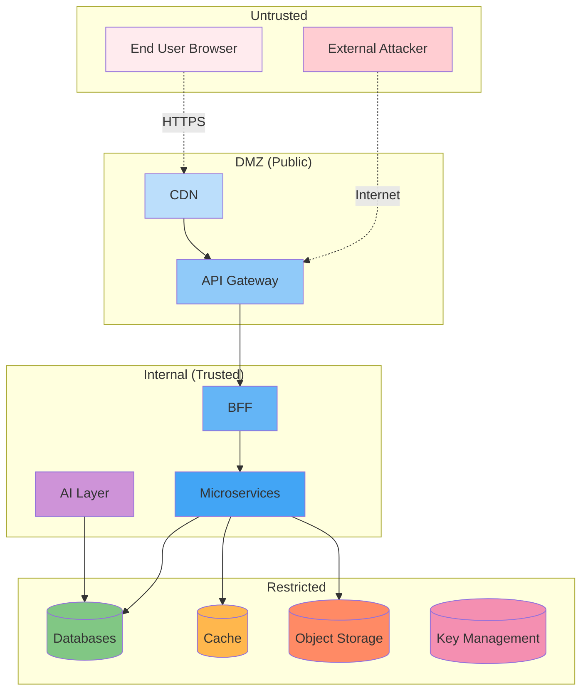

# Threat Model

## Purpose

This document defines the threat model for the Patorbit platform using the STRIDE methodology, identifying assets, actors, trust boundaries, and mitigations.

## Scope

This threat model covers the entire platform architecture.

---

## Assets

| Asset                  | Sensitivity | Description                                        |
| ---------------------- | ----------- | -------------------------------------------------- |
| User Identity          | Critical    | Personal identity, email, phone, auth credentials  |
| Career Passport        | Critical    | Aggregated career history with claims and evidence |
| Claims                 | High        | Individual professional claims                     |
| Evidence               | Critical    | Supporting documents (PDFs, images)                |
| Verification Records   | High        | Verification outcomes and verifier data            |
| AI Prompts and Outputs | Medium      | AI-generated content and prompts                   |
| Payment Data           | Critical    | Subscription and billing information               |
| API Keys               | Critical    | Integration credentials                            |
| Knowledge Graph        | High        | Graph of entities and relationships                |
| Audit Logs             | High        | Immutable security and activity records            |

## Actors

| Actor                | Trust Level     | Description                   |
| -------------------- | --------------- | ----------------------------- |
| Unauthenticated User | Untrusted       | Visitor not logged in         |
| Authenticated User   | User            | Standard platform user        |
| Recruiter            | User (elevated) | User with recruiter role      |
| Organization Admin   | User (elevated) | User managing an organization |
| Platform Admin       | Highly Trusted  | Internal platform operator    |
| AI Service           | Service         | AI orchestration service      |
| External Integration | Varies          | Partner API consumers         |
| Attacker (External)  | Untrusted       | External threat actor         |

## Trust Boundaries

## STRIDE Threat Scenarios

### Spoofing

| Threat                           | Target             | Mitigation                             |
| -------------------------------- | ------------------ | -------------------------------------- |
| Attacker impersonates a user     | Auth Service       | Multi-factor authentication, OAuth 2.1 |
| Attacker fakes a webhook request | Webhook Endpoint   | HMAC signature verification            |
| Attacker impersonates a service  | Service-to-service | mTLS, API keys                         |

### Tampering

| Threat                              | Target          | Mitigation                               |
| ----------------------------------- | --------------- | ---------------------------------------- |
| Attacker modifies evidence file     | Object Storage  | Immutable storage, cryptographic hashing |
| Attacker alters verification record | Database        | Audit logging, database access controls  |
| Attacker modifies AI prompt         | Prompt Registry | Access controls, prompt versioning       |
| Attacker manipulates API request    | API Gateway     | Request signing, validation              |

### Repudiation

| Threat                            | Target        | Mitigation                               |
| --------------------------------- | ------------- | ---------------------------------------- |
| User denies submitting a claim    | Claim Service | Immutable audit logs, digital signatures |
| Admin denies changing permissions | Admin Service | Audit trail with admin identity          |

### Information Disclosure

| Threat                            | Target         | Mitigation                                  |
| --------------------------------- | -------------- | ------------------------------------------- |
| Attacker leaks user passport data | Database       | Encryption at rest, column-level encryption |
| Attacker intercepts API traffic   | Network        | TLS 1.3, HSTS                               |
| Attacker accesses evidence files  | Object Storage | Pre-signed URLs, access logging             |
| Attacker extracts training data   | AI Model       | Zero-retention configuration, PII masking   |

### Denial of Service

| Threat                            | Target       | Mitigation                       |
| --------------------------------- | ------------ | -------------------------------- |
| Attacker overwhelms API endpoints | API Gateway  | Rate limiting, WAF, auto-scaling |
| Attacker exhausts AI credits      | AI Service   | Budget management, usage limits  |
| Attacker floods login endpoint    | Auth Service | Rate limiting, CAPTCHA           |

### Elevation of Privilege

| Threat                               | Target         | Mitigation                           |
| ------------------------------------ | -------------- | ------------------------------------ |
| User escalates to admin role         | Auth Service   | RBAC, regular access reviews         |
| Recruiter accesses restricted data   | Search Service | ABAC, data-level permissions         |
| Attacker bypasses API authentication | API Gateway    | JWT validation, API key verification |

## Attack Surface

| Surface              | Exposure   | Controls                      |
| -------------------- | ---------- | ----------------------------- |
| Public API Endpoints | High       | WAF, rate limiting, auth      |
| Web Application      | Medium     | CSP, XSS protection, CSRF     |
| AI API Endpoints     | Medium     | Authentication, rate limiting |
| Webhook Endpoints    | High       | Signature verification        |
| Object Storage       | Low        | Pre-signed URLs, encryption   |
| Admin Interface      | Restricted | IP allowlisting, MFA          |

## References

- [Risk Management](risk-management.md): Risk assessment process.
- [Security Architecture](security-architecture.md): Controls implementing mitigations.
